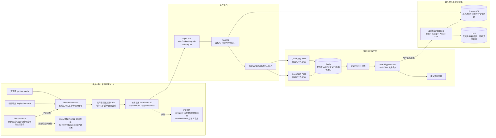

# OfferSteady 面试实时链路商业化审计报告

审计日期：2026-08-27
审计对象：线上 Web、后端、Redis、Qwen 实时 ASR、伴随程序 1.2.0（macOS / Windows x64）
审计方式：代码与 OpenSpec 复核、自动化测试、生产配置检查、生产运行态元数据与脱敏日志检查。未读取或记录音频、完整转录、API Key 或访问令牌。

## 1. 结论

**当前版本不满足商业稳定版发布条件。**

普通链路的功能和自动化测试覆盖较完整，生产后端、Redis、Qwen 预热和发布入口也处于可用状态；但是桌面端存在一个已被线上故障命中的 P0 恢复死路：发布 WebSocket 丢失或重建预算耗尽后，音频源会被标记为永久失败，后续即使本地仍在产生音频帧，也不会再自动建立发布链路。用户只能退出面试或重启助手。

此外，目标设计、运行文档和 1.2.0 实际代码对“唯一音频采集所有者”的定义不一致；真实端到端延迟、长时间稳定性、物理耳机切换和 Windows 真机验收没有完成。因此当前最多可定义为**受控测试版**，不能定义为商业稳定版。

## 2. 当前线上真实架构

### 架构口径冲突

- 当前运行文档和代码声明 Electron Renderer 是唯一生产采集与传输所有者。
- 商业化重构设计仍声明 Swift 原生层是唯一生产采集所有者。
- Electron Main 中仍保留另一套原生音频发布状态机和 HTTP 逐帧兜底；生产配置虽然关闭旧 HTTP，但代码和状态仍存在。
- 这意味着“唯一所有者”没有在设计、文档、代码三层形成一致且可验证的契约。

## 3. 各流程测试结果

| 流程 | 自动化/静态结果 | 生产或真机结果 | 商业结论 |
|---|---|---|---|
| 安装包与发布 | macOS arm64/x64 签名、公证、Staple、Gatekeeper、架构与哈希通过；下载哈希与清单一致 | 1.2.0 已上线，可回滚 | macOS **通过** |
| Windows 分发 | x64 安装包结构、PE、快捷方式测试通过 | 未完成 Windows 物理机双声道全链路；安装包仍是未签名测试包 | **不通过** |
| 设备身份与配对 | 注册、绑定、会话隔离相关测试通过 | 线上可创建发布者并建立连接 | **通过** |
| 权限与首次采集 | 权限拒绝、麦克风 fallback、系统音频错误提示有覆盖 | 多次出现首次收音慢、电脑音频起不来；缺少跨设备矩阵证据 | **有条件通过** |
| 麦克风采集 | 单元和集成测试通过 | 故障会话中本地帧继续增长，后端曾收到并 ACK 麦克风 | 正常路径通过，恢复路径**不通过** |
| 电脑输出采集 | 源恢复、静音监测和独立 VAD 有测试 | 故障会话中无 system receipt，状态为 reconnecting/audio-gap | **不通过** |
| 耳机插拔/默认设备变化 | 部分设备切换测试通过 | 物理摘耳机后稳定恢复验收任务仍未完成，用户已多次复现崩溃/停收 | **不通过** |
| WebSocket 发布与 ACK | 单连接双通道、序号、ACK、gap、重连测试通过 | 线上出现 4 次 publisher 连接后关闭；本地仍采集但 transport 丢失 | **P0 不通过** |
| 断线自恢复 | 有指数退避、传输替换和 watchdog 测试 | `publisher-transport-missing` 和预算耗尽进入永久 terminalFailure；无对应回归测试 | **P0 不通过** |
| 后端入口与 Redis | 队列、背压、Redis 权威状态、重启恢复测试通过 | Redis/PostgreSQL/Web 容器健康，后端无 ERROR；Nginx WS 配置正确 | **通过** |
| Qwen ASR 连接 | 双声道持久会话、预热、去重测试通过 | 故障会话两声道 prewarm 均 ready，无 403；使用公共 DashScope WebSocket | **通过** |
| Partial/Final 实时性 | 相关单测通过 | 未完成真实 Electron→Qwen→Redis→SSE→Browser 的 P50/P95/P99/MAX 报告 | **未验收** |
| 结束收音/端点检测 | 自适应端点逻辑有测试 | 合成基线显示持续噪声可拖到 30 秒硬上限；终止帧队列缺少保留与确认保证 | **不通过** |
| Web SSE 字幕 | 301 个 Web 测试通过，单调合并可防 final 被 partial 覆盖 | 故障会话出现 7 次 `first-snapshot-timeout` 恢复 | **有条件通过** |
| 暂停/恢复与隐私 | 后端权威暂停、丢弃音频、默认不持久化转录有测试 | 生产默认不持久化转录；原始 PCM 仅有界内存 | **通过** |
| 快答/截图回答 | 显式触发、预取不自动回答、Answer SSE 有覆盖 | 本次未做生产内容级测试 | **有条件通过** |
| 计费 | 会话分钟幂等、会员优先、积分兜底与余额不足暂停有测试 | 本次未执行真实账单对账 | **有条件通过** |
| 可观测性 | 有阶段 trace、队列、ACK、重连、资源诊断 | 可以定位 transport 丢失，但 UI 仍可能显示本地 capturing，未形成自动告警与自愈闭环 | **有条件通过** |
| 长时间与并发稳定性 | 未完成 | 30/60/120 分钟 soak、并发和资源泄漏验收未完成 | **不通过** |
| 回滚 | 生产保留后端回滚镜像和公共 DashScope endpoint fallback | 可执行版本回滚 | **通过** |

## 4. 本轮自动化测试明细

### Desktop

- 28 个测试文件、141 个测试全部通过。
- TypeScript 类型检查通过。
- Production build 通过。
- 合成商业基线同时输出两项红灯：
  - 持续会议噪声下，system turn 可能直到 30,000 ms 硬上限才结束。
  - fallback queue 容量 64，但没有终止帧保留和终止 ACK 保证，溢出时可能丢弃终止状态。

### Web

- 42 个测试文件、301 个测试全部通过。
- TypeScript 类型检查通过。
- 未提供生产环境变量时，构建按设计被安全守卫拒绝。
- 使用线上同等公开配置重新构建后通过，共转换 326 个模块。

### Backend

- 全量结果：331 passed、14 skipped、1 failed。
- 唯一失败是并发预热计时断言：要求小于 0.14 秒，实测 0.140231 秒，超出约 0.23 毫秒。
- 单独连续复跑 10 次全部通过，属于全量负载下的时间阈值抖动；说明该性能测试不够确定，但不是本次线上停收的直接原因。
- 实时链路与发布兼容测试：66 passed、2 skipped。
- 发布/下载测试：7 passed。

### OpenSpec

以下相关变更均通过 `openspec validate <change> --strict`：

- `rebuild-commercial-realtime-interview-pipeline`
- `recover-system-audio-after-output-device-switch-1-1-8`
- `fix-dual-channel-ack-deadlock-1-1-7`
- `reduce-live-first-partial-latency-2026-08-27`
- `fix-live-first-transcript-delivery-latency`
- `optimize-realtime-asr-pipeline`
- `fix-desktop-audio-renderer-crash`

但商业化变更仍有未完成任务。严格校验通过不等于发布验收通过。

## 5. 生产运行态检查

- 生产传输：`websocket-v2`。
- 旧 HTTP 音频入口：生产显式关闭。
- Redis 实时权威状态：生产强制启用。
- Qwen 模型：`qwen3-asr-flash-realtime-2026-02-10`。
- Qwen 地址：公共 DashScope WebSocket，与阿里云工单最终答复一致。
- 本次检查时间窗内 Qwen 双声道预热成功 10 次、失败 0 次；没有 ASR 403。
- 后端日志 ERROR 级事件 0；出现的 HTTP 403 是未带业务授权访问应用接口，并非 DashScope 403。
- 公网 `/healthz` 30 次：p50 97.11 ms，p95 109.61 ms，最大 114.18 ms。该指标只证明健康接口可达，不能代表音频到字幕延迟。
- 容器快照：Backend 约 202 MiB、Redis 约 20 MiB、PostgreSQL 约 109 MiB，均健康；这不是长时间资源泄漏证明。

## 6. 已定位的线上故障链

1. 用户电脑 1.2.0 成功绑定并进入 live。
2. 后端为 microphone 和 system 两声道完成 Qwen 预热。
3. 桌面先后建立 4 条 publisher 连接，最后一条随后关闭。
4. 麦克风本地 frameCount 继续增长，说明采集回调仍工作。
5. 后端只保留到较早的 microphone receipt，system 没有 receipt。
6. 桌面状态出现 `publisher-transport-missing`；system 同时为 `audio-gap/reconnecting`。
7. `sendFrame()` 在 transport 为空时直接执行 `markTerminalLost()`。
8. reliability controller 对 terminalFailure 永久返回 `action=none`，watchdog 不会再恢复。
9. 页面可继续显示“进入面试”或本地采集状态，但实际服务端已收不到新音频。

这解释了“另一台电脑进入面试后第一句话很慢、后来直接不显示、重开后暂时恢复”的现象。主要矛盾不在 Qwen 权限或服务器性能，而在桌面发布链路的恢复状态机。

## 7. 商业化阻断项

| 优先级 | 阻断项 | 必须达到的验收 |
|---|---|---|
| P0 | transport 丢失后进入永久 terminalFailure | 网络断开、服务重启、publisher 替换后 5 秒内恢复；无需重启助手；新帧获得 ACK |
| P0 | 本地 capturing 与服务端无 receipt 状态不一致 | UI 只展示服务端权威健康；无 ACK 时立即降级并自动重建 |
| P0 | 采集所有者设计/文档/代码冲突 | 明确并实现单一 owner；删除或严格隔离另一条发布路径 |
| P0 | system audio 耳机切换后不可恢复 | macOS 与 Windows 物理设备矩阵全部通过，麦克风健康通道不得被连带重置 |
| P1 | 终止帧可能被普通队列挤掉 | terminal 独立保留、重发并获得 terminal ACK；“识别未完成”有界收敛 |
| P1 | 持续噪声可拖到 30 秒 | 真实会议噪声下 final latency p95 ≤ 2 秒，且不错误切断正常说话 |
| P1 | Web 首快照频繁超时 | 首快照/SSE 恢复有明确 SLO、告警和压测证据 |
| P1 | Windows 未签名且无物理全链路验收 | Authenticode 签名、SmartScreen 基线和 Windows 10/11 真机验收通过 |
| P1 | 缺少真实端到端性能报告 | 输出各阶段 P50/P95/P99/MAX，转录 final p95 ≤ 2 秒、控制 p95 ≤ 500 ms |
| P1 | 缺少长时间稳定性证据 | 30 分钟发布门槛通过，再完成 60/120 分钟双声道 soak；连接、FD、内存和队列保持有界 |

## 8. 发布判定

- macOS 安装包完整性：通过。
- 后端基础设施与 Qwen 连通：通过。
- 正常路径自动化：大部分通过。
- 故障恢复、端到端时延、设备切换、Windows 真机和长稳：不通过或未验收。

**最终判定：NO-GO。暂停将 1.2.0 宣称为商业稳定版；保留为受控测试版和回滚对象。**

修复顺序应是：先消除 P0 发布恢复死路和所有权冲突，再补终止帧可靠性与 system audio 设备切换，随后执行真实延迟、Windows 真机和长稳验收。只有所有发布门槛有可重复证据后，才应发布新的商业版本。

## 9. 审计后本地修复状态

2026-08-27 本地工作树已修复本报告识别的 `publisher-transport-missing` 永久失联死路：短暂失败改为单飞、有界指数退避并持续恢复，恢复期间保持权威 `reconnecting` 状态，只有明确终止的发布授权响应才停止重试。新增回归后 Desktop 全量结果为 28 个测试文件、142 个测试通过，类型检查、生产构建和 OpenSpec 严格校验通过。

该状态仅代表本地待验收版本；生产 1.2.0 尚未因此自动改变，商业 NO-GO 结论仍需在物理设备和长稳验收通过后解除。
