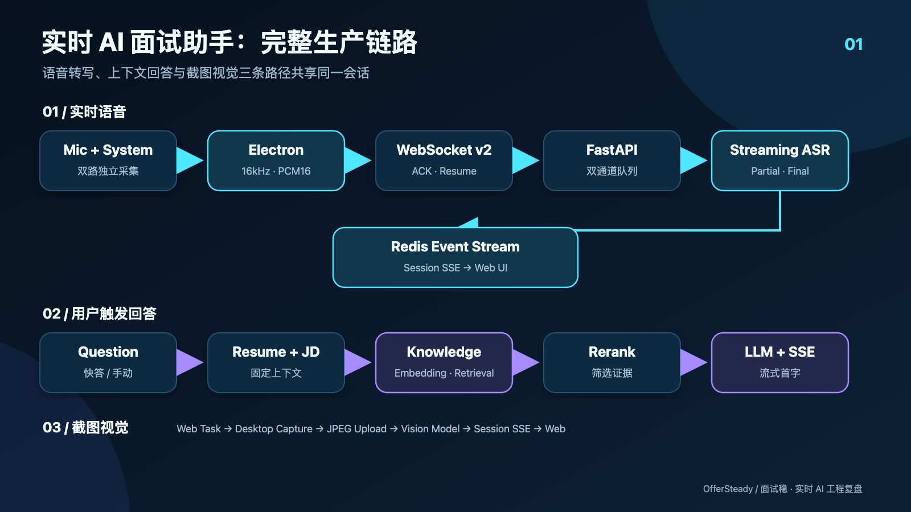
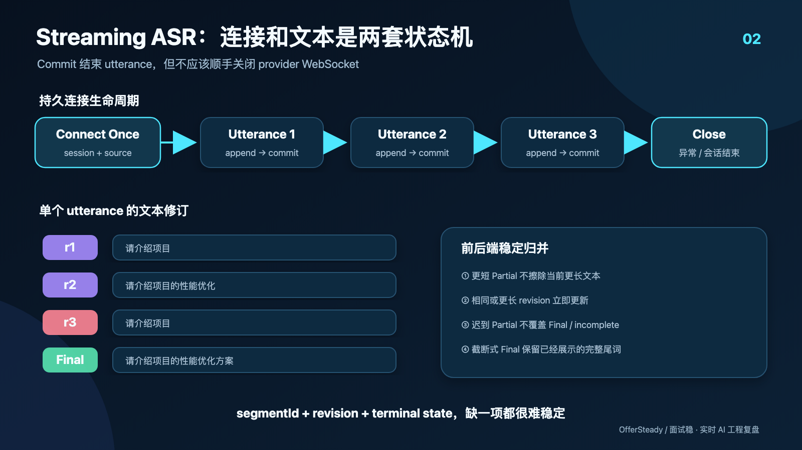
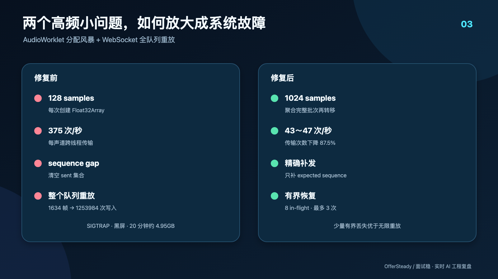
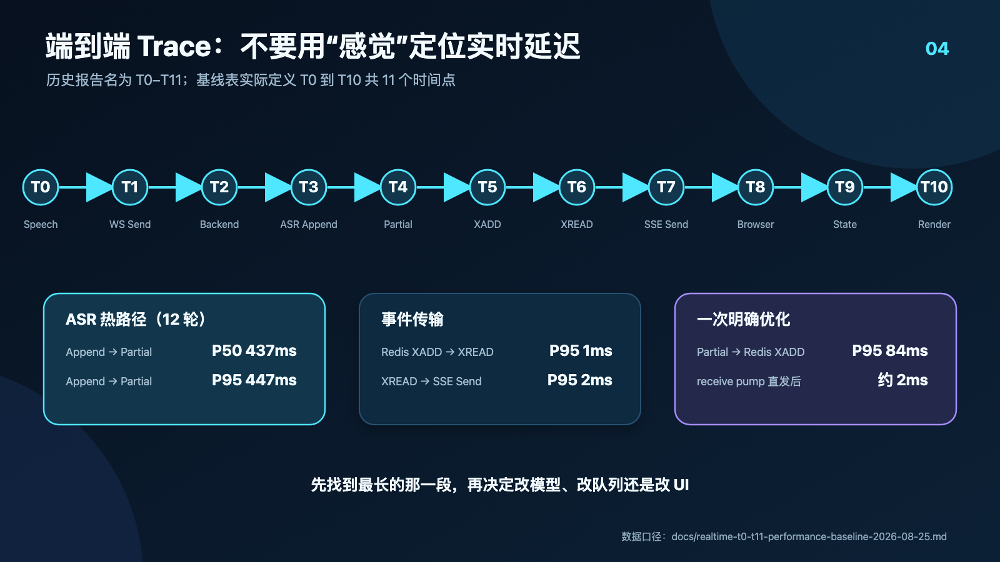

# AI 面试助手到底是怎么做到实时回答的？

> Electron + Streaming ASR + WebSocket + RAG + LLM 的完整实时 AI 技术链路

AI 面试助手看起来好像很简单：

```text
音频 → ASR → LLM → 答案
```

我最开始做的时候也是这么想的。真正把链路跑起来以后才发现，最难的并不是调用一次 LLM，而是回答一个更具体的问题：

**面试官开始说话以后，用户到底多久能在页面上看到一段可以使用的回答？**

采集端可能积压音频，Streaming ASR 的 Partial 会反复改写，一句话结束的边界不稳定，WebSocket 会断，RAG 会增加等待，浏览器收到 SSE 也不等于已经完成绘制。任何一段出问题，用户得到的感受都只有一个：怎么还没有反应？

下面分享的是我开发「面试稳」时实际落地的一条链路，以及其中几个比调用模型难得多的工程问题。

## 1. 先看完整架构



当前系统有两条主要输入链路。

语音链路负责持续对话：

```text
Microphone ─┐
            ├→ Electron Companion
System Audio┘        ↓
                PCM16 Audio Frames
                        ↓
               Authenticated WebSocket
                        ↓
                  FastAPI Backend
                        ↓
              Mic / System ASR Session
                        ↓
                 Partial / Final
                        ↓
                Redis Event Stream
                        ↓
                  Session SSE → Web

用户触发回答
        ↓
Resume + JD + Conversation Context + Knowledge
        ↓
Retrieval + Rerank
        ↓
LLM Streaming → Answer SSE → Web
```

截图链路独立运行：

```text
Web 创建截图任务
→ Desktop 领取任务
→ 截取并压缩当前屏幕
→ Upload
→ Vision Model
→ Streaming Answer
→ Session SSE
→ Web
```

这里有一个产品行为需要先说明：**转写完成不会自动创建答案。** 当前实现把字幕确认和回答生成拆开，用户通过快答、手动输入或截图明确触发回答。这样可以避免连续语音不断创建任务，也能减少答案乱序和费用失控。

## 2. 为什么需要 Electron Companion

如果只收麦克风，浏览器的 `getUserMedia` 已经够用。但远程技术面试通常发生在腾讯会议、飞书或 Zoom 一类软件中。系统至少要区分两种声音：

- `microphone`：候选人自己的回答；
- `system`：电脑输出，也就是面试官的声音。

当前生产链路由 Electron Renderer 负责采集。麦克风来自 `getUserMedia`；系统音频通过 display loopback 获取音轨，拿到音频后立即停止不需要的视频轨。两路音频不会先混成一条再猜说话人，而是分别携带来源标识进入后端。

这么做有三个直接收益：

1. 问题候选主要从面试官声道产生；
2. 候选人的发言可以进入会话上下文；
3. 某个声道短暂异常时，另一个声道仍可以独立工作。

采集后的音频会被转换为 16 kHz、单声道 PCM16。桌面端按约 100ms 的节奏组织增量帧，再送进有界发送队列。原始 PCM 默认只存在于内存中，不落 PostgreSQL、Redis、OSS 或诊断文件。

桌面端和 Web 展示层是分离的。Electron 负责采集与发送，Web 负责字幕、回答和交互，两端通过同一面试会话绑定。这也是为什么页面刷新或换到手机、平板查看内容时，不应该反过来中断桌面的音频采集。

## 3. Streaming ASR 不能等整句话结束

传统离线方案通常是：

```text
录完整段音频 → 上传 → ASR → LLM
```

如果一段话持续 8 秒，模型至少要在 8 秒以后才开始识别。这条路线天然做不到实时反馈。

Streaming ASR 的做法是持续发送 Audio Frame，服务商持续返回当前识别假设：

```text
说话开始
  ↕
不断发送 PCM16 Frame
  ↕
持续收到 Partial
  ↓
Commit
  ↓
Final
```

`Partial` 是当前音频缓冲区的临时识别结果，`Final` 才是服务商完成本段解码后的权威结果。它们必须带有 `segmentId`、`revision` 和终态，否则前后端很难判断一条更新应该覆盖哪一段文字。

桌面到 FastAPI 后端使用一条认证 WebSocket，并在其中复用 Mic 和 System 两个逻辑通道。后端为两个来源维护独立的有界队列和 ASR Session。桌面断线后采用退避重连；连接恢复时，根据服务端返回的 `resumeOffsets` 清理已确认帧，再补发仍然有效的未确认帧。

一个简化后的发送状态可以写成：

```ts
type AudioFrame = {
  channel: "microphone" | "system";
  sequence: number;
  capturedAtMs: number;
  pcm16: ArrayBuffer;
};

if (socket.readyState === WebSocket.OPEN && inFlight.size < MAX_IN_FLIGHT) {
  socket.send(encode(frame));
  inFlight.set(frame.sequence, frame);
}

// ACK 到达后只删除服务端已经连续接收的帧
onAck(({ channel, acceptedThrough }) => {
  dropAcknowledgedFrames(channel, acceptedThrough);
});
```

代码看上去不复杂，真正麻烦的是连接生命周期和异常恢复。

## 4. 第一个坑：每段语音几乎都重新创建 ASR WebSocket

早期实现表面上已经支持“长连接”，线上 Trace 却给出了另一组结果：

- 麦克风 `commit_count=103`，`connection_recreations=105`；
- 系统音频 `commit_count=90`，`connection_recreations=89`。

提交次数和连接创建次数几乎一一对应。这说明所谓的复用只发生在单个 utterance 内，每开始一段新语音，仍然会重新连接服务商。

原因是桌面每开始一个新语音段都会增加 `sourceGeneration`，ASR Gateway 当时又把 generation 放进了连接复用条件。于是代码虽然保存了连接，下一段语音却总因为 generation 不一致而放弃复用。

旧行为接近：

```text
Connect → Utterance 1 → Commit → Close
Connect → Utterance 2 → Commit → Close
Connect → Utterance 3 → Commit → Close
```

连接握手和初始化不仅增加首字延迟，还会占用对应声道的 worker，造成短时音频积压。

后来的修复是把 provider session 复用键收敛到 `interview session + source kind`。`commit` 只结束当前 utterance，不关闭 WebSocket；只有会话结束、空闲超时、连接异常或不可恢复错误才重建。

```python
# 伪代码：generation 用于桌面发布代际，不决定 ASR 连接是否复用
key = (interview_session_id, source_kind)
session = sessions.get(key)

if session is None or not session.is_healthy():
    session = create_streaming_asr_session()
    sessions[key] = session

session.append_audio(frame.pcm16)

if frame.is_final:
    session.commit_utterance()   # 保留底层 WebSocket
```

真实 macOS 连续播放 12 分 19 秒的验证中，System 声道新增 62 个 utterance，测试窗口内连接创建和重连都为 0，全部复用了已经预热的连接；该后端进程累计约 115 个 utterance，只使用了 2 条 System 连接。

## 5. 第二个坑：Partial 不是可以直接 append 的文本

Streaming ASR 的 Partial 经常被误解为“新增加的几个字”。实际服务商返回的通常是当前缓冲区的完整假设，例如：

```text
r1: 请介绍项目
r2: 请介绍项目的性能优化
r3: 请介绍项目
r4: 请介绍项目的性能优化方案
```

如果前端每次 append，就会得到重复文字；如果只根据更大的 revision 整行覆盖，`r3` 又会把用户已经看到的“性能优化”擦掉。

这正是项目里真实出现过的字幕回缩问题。后端先发布了更完整的文本，后续更高 revision 的短假设又覆盖它，前端按照 revision 更新后，字幕肉眼可见地倒退。



当前前后端都执行可见文本的稳定规则：

```python
def merge_visible(current, incoming):
    if current.is_terminal:
        return current                 # 迟到 Partial 不覆盖终态

    if incoming.is_final:
        if current.text.startswith(incoming.text):
            return current.as_final()  # 防止截断式 Final 擦除已见尾词
        return incoming

    if len(incoming.text) < len(current.text):
        return current                 # 更短的临时假设不回缩 UI

    return incoming
```

生产代码还会结合 revision、segment 和 terminal state，伪代码只是表达核心原则。

`Final` 原则上仍然是权威结果，因为它可能纠正同音字或专有名词。但如果 Final 只是当前长文本的严格前缀，系统会把它视为截断式 commit，避免用户刚看到的尾词瞬间消失。

## 6. 最难的问题：什么时候算一句话说完

面试官停顿 500ms，可能是在思考，也可能已经把问题说完。结束太早会截掉尾词，结束太晚又会让用户一直等。

当前生产实现没有一套可以宣传为“语义 Endpoint Controller”的模块。它仍以本地能量判断和 manual commit 为主，综合动态噪声底、起音阈值、持续阈值、attack、静音 tail 和最大句长。

当前保守的静音 tail 上限是：

- 麦克风 480ms；
- 系统音频 350ms。

如果环境已经回到清晰静音，可以分别缩短到 280ms 和 220ms。系统音频还会观察短时间窗中的能量变化，避免会议软件的背景声或数字底噪让一句话一直延长到最大时长。

本地检测到静音以后，链路还没有结束：

```text
Local Silence
→ 发送最后一批 PCM
→ input_audio_buffer.commit
→ 等待云端 completed
→ Final Transcript
```

也就是说，“本地不再说话”和“云端 Final 已经产生”是两个时间点。页面会先进入 `committing`，停止闪烁的转写光标，等 Final 到达后再完成校正。如果连接异常或 Final 缺失，后端 watchdog 会在有界时间后把本段标记为 `incomplete`，而不是永远停留在转写中。

项目也做过 Server VAD 对比。一次相同音频测试中，manual 路径从停止说话到 Final 约 797ms；Server VAD 在 8 秒观察窗口里仍未完成，只产生了不完整 Partial。因此当前生产默认仍使用 manual commit。语义断句属于可以继续优化的方向，还不能写成已经上线。

## 7. WebSocket 可靠性：ACK 设计不当会制造发送风暴

为了在短暂断网后恢复，桌面端会保存有限数量的未确认音频帧。但“能够补发”不等于“收到 gap 就重放整个队列”。

一次真实故障中，1634 个唯一系统音频帧触发了 1253984 次 WebSocket 写入。网络进程在约 20 分钟内发出了约 4.95GB 数据。

根因是每次收到 sequence gap 后，客户端都会清空 sent 集合，再把队列全部重放。重放又产生新的 gap，最终形成正反馈。

修复后的规则是：

- 每个逻辑通道最多 8 个未确认帧；
- 服务端 ACK 已连续接收的最大序号；
- 出现 gap 时，只补发服务端明确要求的 expected sequence；
- 相同 gap 在 500ms 内去重；
- 单个序号最多补发 3 次；
- 本地已不存在缺失帧时，丢弃不可恢复的小段并创建新的 publisher 身份，从最新音频继续。

实时系统的恢复策略必须有边界。无限追求“一个字节都不能丢”，可能让一次很小的丢帧升级成整场会话不可用。

## 8. 一个 Float32Array，为什么会让 Electron Renderer 崩溃

另一个问题甚至和 AI 没有直接关系。

早期 AudioWorklet 每处理一个 128 sample 的 render quantum，就创建新的 `Float32Array`，再把 backing buffer 转移到 Renderer。48 kHz 下，每个声道每秒大约发生 375 次跨线程传输。

单次 allocation 很小，但双声道长时间运行以后，五份 macOS crash report 显示 Renderer 都以 `EXC_BREAKPOINT/SIGTRAP` 退出，崩溃前积累了约 13 万到 26.6 万个虚拟内存区域。主进程还活着，用户重新打开窗口时只看到黑屏。

修复方式是让 Worklet 先累积 1024 samples，再一次性转移完整 buffer。这样会增加约 21～23ms 的采集等待，但每声道传输频率下降到约 43～47 次/秒。

30 分钟双声道合成 soak 中，传输次数从旧算法估算的 135 万次下降到 168750 次，减少 87.5%。音量计和健康状态也限制在最高 10Hz，避免 React 跟随音频回调频率持续重绘。



这个问题给我的教训很直接：实时音频中，一个“每帧只分配一点”的操作，乘以声道数、回调频率和面试时长后，可能变成系统级问题。

## 9. Final 之后，为什么不能直接把问题交给 LLM

如果问题是“介绍一下你之前做的 RAG 项目”，通用 LLM 并不知道“你的项目”是什么。

当前资料链路把上下文分成两类：

1. Resume 和 JD 是本场会话确认后的固定上下文；
2. Knowledge Documents 才进入 RAG 检索。

知识检索流程包括 Query Embedding、会话与资料版本过滤、向量召回和 Rerank。过滤条件包含资料所有者、本场 session、document ID 和 document version，避免不同用户或不同版本的材料串入回答。

```text
Question
+ Resume
+ JD
+ Conversation History
+ Retrieved Knowledge Chunks
        ↓
Prompt Assembly
        ↓
LLM Streaming
```

JD 也不是装饰。同一个候选人面试 Java 后端、大模型应用或 AI Agent 岗位，应该突出不同的经验。Resume 说明候选人做过什么，JD 说明当前岗位关心什么，Knowledge 补充项目细节，会话历史则解释当前追问的上下文。

如果检索没有命中，Prompt 明确要求不能编造公司、职责、项目结果或数字。RAG 在这里不仅用于补充知识，也承担个人事实边界。

关于 pgvector，需要如实说明当前实现差距：仓库已经启用 pgvector，正式迁移中也包含 `vector(1536)` 和 IVFFlat cosine index；但当前运行时注入的 `PostgresRuntimeVectorStore` 仍把向量保存在 `vector_json JSONB`，读取候选数据后在 Python 中计算 cosine similarity。数据库向量算子是已有目标结构，尚未成为当前运行时主路径。

回答生成也不是简单串行地等待完整 RAG。当前链路先使用固定资料生成简要回答；完成问题归一化后，可以并行预取详细知识；详细回答再结合检索结果和简要回答锚点继续流式生成。Answer SSE 负责低首字延迟，会话 SSE 负责可靠的任务状态与恢复。

## 10. 真正要优化的是端到端延迟

`LLM Latency` 不等于 `User Perceived Latency`。

一次完整等待可以近似写成：

```text
T_total = T_audio
        + T_asr
        + T_endpoint
        + T_retrieval
        + T_rerank
        + T_llm
        + T_transport
        + T_render
```

只替换一个首字更快的模型，不一定让用户明显感觉更快。如果桌面已经积压 2 秒音频，或者句尾判断多等了 3 秒，LLM 节省的 200ms 几乎没有体感。

2026 年 8 月 25 日的真实 Qwen + Redis + SSE 热路径测试进行了 12 轮，Qwen append 到首个 Partial 的 P50/P95 为 437/447ms；Redis XADD 到 XREAD 的 P95 为 1ms，XREAD 到 SSE Send 的 P95 为 2ms。

这组数据说明，在该测试环境里，Redis 和 SSE 不是主要瓶颈。盲目改事件总线或增加 worker，解决不了 ASR 首字和连接生命周期问题。

## 11. 用 T0–T11 Trace 代替猜测

当用户只说“字幕慢”，Electron、网络、队列、ASR、Redis、SSE 和 React 都像嫌疑人。没有连续 Trace，只能靠日志时间和感觉猜。

项目文档沿用“T0–T11”这个名称，但 2026-08-25 的基线表实际列出的是 T0 到 T10，共 11 个时间点：

| 时间点 | 含义 |
| --- | --- |
| T0 | 语音活动开始 |
| T1 | 桌面首帧真正执行 `WebSocket.send` |
| T2 | FastAPI 后端收到首帧 |
| T3 | Qwen 音频 append 完成 |
| T4 | Qwen Partial 到达接收线程 |
| T5 | Redis XADD 完成 |
| T6 | Redis XREAD 返回事件 |
| T7 | SSE 增量发送 |
| T8 | 浏览器收到事件 |
| T9 | 浏览器本地状态更新 |
| T10 | React commit 后确认渲染 |



这套 Trace 曾经纠正过两个误判。

第一个误判是 `sentAtMs` 的位置。早期它在音频帧进入本地队列时就记录，因此报表中的“Send → Backend”混入了桌面排队时间，不能解释为公网 RTT。后来 T1 被移动到真正的 `WebSocket.send` 边界。

第二个误判是 Partial 发布。接收线程已经拿到 Qwen Partial，但同步 append 调用要等下一帧才把它取出并发布，额外增加 P50 61ms、P95 84ms。改为 receive pump 直接进入字幕发布支路以后，后续探针中的 Qwen Partial → Redis XADD 降到约 2ms。

Trace 也提醒我不要滥用 P50/P95。一次后台页面测试只取得少量完整浏览器 ACK，虽然观测到了很大的 T0 → Browser Partial 数值，但样本覆盖不足，不能包装成前台用户的正式指标。没有数据的阶段应该留空，而不是用相邻阶段推算后写成“实测”。

## 12. Screenshot Answer 为什么必须走另一条链路

程序员面试经常出现代码、算法题、SQL、架构图和报错截图。ASR 无法理解屏幕内容，所以截图回答从任务创建开始就是一条独立的视觉链路。

当前流程是：Web 创建 capture request 并立即显示处理中；桌面通过认证 Device SSE 领取任务，推送失败时才使用非重叠轮询兜底；Electron 在并发锁保护下截取当前屏幕、压缩成 JPEG 并上传；后端记录 `requested`、`claimed`、`uploaded`、`vision-running` 和最终状态，再调用视觉模型流式生成结果。

当前截图回答只基于截图内容和用户选择的编程语言，不会把最近的面试官转写、Resume、JD 或知识库暗中拼进去。

受控样本中，2.25MB 原始截图被压缩到约 91.5KB，桌面压缩约 0.14 秒；正常样本里视觉模型约 13.4～13.6 秒，OSS 写入约 3 秒。2026 年 8 月 20 日报告的最近 24 小时生产样本为 6/6 成功，视觉阶段平均 10.23 秒、P95 12.09 秒。

这些数字的口径也不同：生产聚合主要覆盖视觉任务阶段，不包含每次用户点击到浏览器最终绘制的完整链路，因此不能直接宣传成截图端到端耗时。

## 13. 最后真正做出来的，不是“ASR + ChatGPT”

完成这套系统后，我最大的感受是：AI 面试助手不是把语音识别和大模型接起来就结束了。

它实际上是一个实时、多模态、有状态、带用户上下文的 AI 系统：

- Electron 负责音频与屏幕输入；
- WebSocket、ACK、Resume 和有界补发负责实时传输；
- Partial、Final、revision 和 commit 组成流状态机；
- Resume、JD、Knowledge 和 Conversation 构成个人上下文；
- Embedding、Retrieval 与 Rerank 决定给模型什么证据；
- LLM 和 Vision Model 负责生成；
- SSE、前端单调归并和 React Render 决定结果何时真正被用户看到；
- Trace 和百分位指标负责告诉开发者下一步应该优化哪里。

上面这些问题，基本都是我在开发「面试稳」过程中实际遇到的。它目前提供实时面试辅助、Resume/JD 上下文、知识资料检索、流式回答建议、技术面试截图识别和面试复盘等能力。

如果你想看看这套链路最后对应的产品形态，可以访问一次：[面试稳｜AI 面试助手](https://mianshiwen.cn/)。

对我来说，做完它最大的收获不是又接入了几个模型，而是学会把“用户觉得慢”拆成一组可以观测、可以复现、也可以逐段优化的工程问题。
