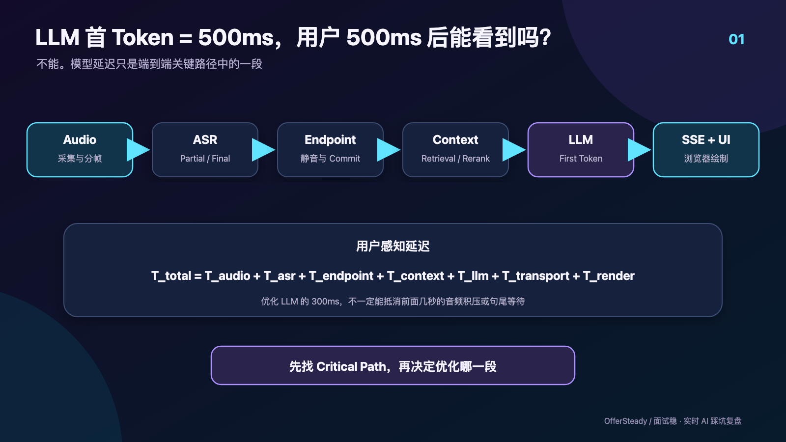
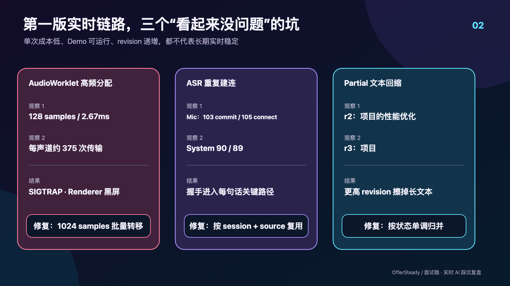
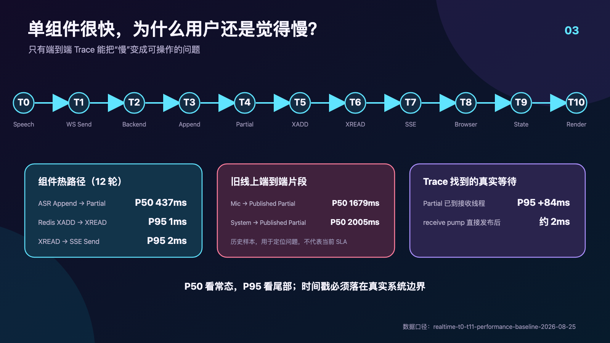

# 做了一个实时 AI 面试助手后，我发现最难的根本不是 LLM

最开始做这个项目时，我觉得架构应该挺简单。

```text
音频 → ASR → LLM → 答案
```

实时语音识别已经很成熟，大模型首 Token 也越来越快。只要把两者接起来，再做一个页面显示答案，似乎就差不多了。

真正跑起来以后，我才发现这个理解完全错了。

用户说“慢”，可能跟 LLM 一点关系都没有。可能是 Electron 还没把音频发出去，可能是 ASR 每句话都在重新握手，可能是系统一直等不到一句话的结束，也可能是浏览器已经收到数据，却还没有完成状态更新和绘制。

假设 LLM First Token 是 500ms，不代表用户 500ms 后就能看到答案。用户真正经历的是：

```text
面试官开始说话
→ Electron 捕获音频
→ AudioWorklet 处理
→ Audio Frame 进入发送队列
→ WebSocket
→ Streaming ASR
→ Partial
→ Commit / Final
→ 问题确认与上下文构建
→ Retrieval / Rerank
→ LLM First Token
→ SSE
→ Browser State
→ React Render
→ 用户看到内容
```



后来我给这件事总结了一句话：

**LLM Latency ≠ User Perceived Latency。**

## 第一个坑甚至发生在 AI 之前

线上面试里有两种声音。候选人的声音来自麦克风，面试官的声音通常来自会议软件，也就是电脑输出。

只采麦克风，浏览器就能完成；要同时获取系统音频，就需要桌面伴随程序。当前实现由 Electron Renderer 采集两路音频，分别标记为 `microphone` 和 `system`，转换成 16kHz、单声道 PCM16，再按大约 100ms 的节奏形成增量帧。

两路声音不能先混起来再处理。系统要知道哪句话来自面试官，哪句话来自候选人：前者用于形成问题，后者用于保持对话上下文。如果混成一条流，后面再依赖说话人分离，不仅增加复杂度，还会把识别错误传递给问题判断。

到这里其实还没有调用 ASR，但实时系统的问题已经出现了：权限、声卡切换、系统音频、采样率、背压、帧序号、双通道状态和断线恢复，任何一项都可能让后面的模型拿不到正确输入。

## 一个很小的 allocation，差点把 Electron 搞崩

最让我意外的故障来自 AudioWorklet。

第一版里，Worklet 每处理一个 128 sample 的 render quantum，就创建一个新的 `Float32Array`，再把 backing buffer 转移给 Renderer。代码看起来很正常：数组很小，转移也没有复制整块内存。

但 48kHz 下，128 samples 大约每 2.67ms 就会触发一次，每个声道每秒接近 375 次。双声道运行几十分钟后，问题的计算方式变成了：

```text
一次很便宜的 allocation
× 每秒数百次
× 两个声道
× 一场长时间面试
```

五份 macOS crash report 指向相同现象：Electron Renderer 以 `EXC_BREAKPOINT/SIGTRAP` 退出，崩溃前累积了约 13 万到 26.6 万个虚拟内存区域。主进程还活着，所以用户重新打开窗口时看到的是黑屏，而不是一个明确的崩溃提示。

最后的修复并不“AI”。Worklet 先累计 1024 samples，再转移一个完整 buffer。单批增加约 21～23ms 采集等待，但跨线程传输频率下降到每声道约 43～47 次/秒。

30 分钟双声道合成 soak 中，传输次数从旧算法估算的 135 万次降到 168750 次，减少 87.5%。音量计和健康状态也限制在最高 10Hz，避免 React 跟着音频回调一起高频刷新。

修完以后我才真正意识到：

> 实时系统最怕的经常不是一次很慢的操作，而是一个看起来很便宜、每秒却会执行几百次的操作。

## Demo 能跑，不代表 Streaming ASR 的连接是对的

音频进入后端以后，下一步是 Streaming ASR。桌面端持续发送 PCM16 Frame，服务商不断返回 Partial；本地判断一句话结束后发送 commit，再等待云端 Final。

我一开始以为自己已经实现了 ASR 长连接。直到一次线上诊断看到这组数字：

- 麦克风：103 次 commit，105 次连接重建；
- 系统音频：90 次 commit，89 次连接重建。

提交次数和连接次数几乎一样。所谓的“长连接”，实际只在单个 utterance 内存在。

问题出在连接复用条件。桌面每开始一段新语音都会更新 `sourceGeneration`，ASR Gateway 又要求 generation 相同才复用连接。结果就是：

```text
Connect → Utterance 1 → Commit → Close
Connect → Utterance 2 → Commit → Close
Connect → Utterance 3 → Commit → Close
```

短 Demo 看不出明显问题，因为它只说一两句话。真实面试会持续几十分钟，连接握手和初始化会反复进入关键路径，还会暂时占住每个声道的 worker，造成音频队列短时积压。

修复后，provider session 的复用键改成 `interview session + source kind`。commit 只结束当前 utterance，不关闭底层 WebSocket。只有会话结束、空闲超时、连接异常或不可恢复错误才重建。

一场真实 macOS 连续播放 12 分 19 秒的验证中，System 声道新增 62 个 utterance，测试窗口内新建连接为 0、重连为 0，全部复用了已经预热的连接；当时后端进程累计约 115 个 utterance，只使用了 2 条 System 连接。

项目确实有 Heartbeat，但需要把概念说准确：Web 页面和桌面设备会定期更新 lease，SSE 空闲时会发送 keepalive。当前 ASR Gateway 没有一套自定义应用层 Ping/Pong 协议，所以我不会把“ASR 自定义 Ping/Pong”写成已经上线的能力。连接失效主要通过收发异常、超时和会话状态发现。

这次故障留下的结论是：**在实时系统里，连接本身也是延迟预算的一部分。**

## Partial 会反悔，不能当字符串 append

Streaming ASR 返回的 Partial，不一定是“比上次多几个字”。它通常是服务商对当前 buffer 的完整识别假设。

例如连续收到：

```text
r1  请介绍项目
r2  请介绍项目的性能优化
r3  请介绍项目
r4  请介绍项目的性能优化方案
```

如果直接 append，字幕会重复。如果只要 `newRevision > oldRevision` 就整行覆盖，`r3` 又会把用户刚刚看到的“性能优化”擦掉。

项目里真实出现过这种字幕回缩。后端发出更高 revision，前端按规则覆盖，逻辑上没有处理错任何一个字段，用户看到的文字却在往回跳。



后来前后端都增加了可见文本稳定规则：

- 非 Final 的更短假设不能擦掉当前更长文本；
- 相同长度或更长的 revision 可以及时更新；
- 已进入 `final` 或 `incomplete` 的段，不接受迟到 Partial；
- Final 原则上具有权威性，但严格前缀形式的截断 Final 不删除已展示的完整尾词。

实现这套规则需要的不只是 text，还包括 `segmentId`、`revision` 和 `terminalState`。

我后来不再把 Streaming 文本理解成一个不断变长的字符串。它更像一条会被修订、回退、提交和冻结的状态记录。

## 用户停止说话，不等于 ASR 已经完成

接下来是最难调的一段：Endpoint。

面试官可能会说：“你介绍一下之前做的那个……”停顿半秒，然后继续：“RAG 项目吧。”

如果半秒时立即提交，LLM 收到的只有半句话；如果一直等，用户又会觉得系统反应迟钝。

当前生产实现没有一套可以称为“语义 Endpoint Controller”的模块。主要依据仍然是本地能量判断：动态噪声底、起音阈值、attack、静音 tail 和最大句长。当前保守 tail 上限是麦克风 480ms、系统音频 350ms；检测到清晰静音时，可以分别缩短到 280ms 和 220ms。

但本地静音成立，只代表桌面认为本轮语音结束。真正得到 Final 还需要：

```text
Local Silence
→ 发送最后一批 PCM
→ input_audio_buffer.commit
→ Cloud ASR 继续解码
→ completed / Final
```

UI 的“已经不说了”和云端的“最终识别完成了”不是同一个时间点。当前界面会先把这段标记为 `committing`，等权威 Final 到达；如果 Final 在有界时间内没有出现，watchdog 会把它收口为 `incomplete`，避免一行字幕永远停在转写中。

项目做过 manual commit 和 Server VAD 的同音频比较。一次测试中，manual 路径从停止说话到 Final 约 797ms；Server VAD 在 8 秒观察窗口里仍然没有完成，只得到不完整 Partial。因此当前生产仍以 manual commit 为默认选择。

这不是说 Server VAD 永远不好，只说明在当时的模型、参数和音频条件下，它没有达到当前链路需要的结果。后续可以探索语义断句，但那仍是优化方向。

Endpoint 本质上没有一个永远正确的数字，它一直在平衡两件事：

```text
更短等待 ← Latency  ↔  Completeness → 更完整的问题
```

## 可靠性修复，差点制造了更大的故障

WebSocket 断开后，客户端需要补发尚未确认的音频帧。这个需求听起来很合理，但第一版恢复逻辑过于激进：每次收到 sequence gap，就清空 sent 集合并重放整个队列。

一次真实故障中，1634 个唯一系统音频帧触发了 1253984 次 WebSocket 写入。大约 20 分钟内，网络进程发出了约 4.95GB 数据。

为了“不丢一帧”，系统反而进入了无限重放。

后来恢复规则被改成严格有界：每个逻辑通道最多 8 个未确认帧；服务端 ACK 连续序号；出现 gap 时只补发明确缺少的 expected sequence；相同 gap 在 500ms 内去重；单个序号最多补发 3 次。

如果客户端已经没有缺失帧，就承认这一小段无法恢复，创建新的 publisher 身份，从最新音频继续。

在实时场景里，少量有界丢失有时比“永远保证完整”的重试更可靠。因为用户真正需要的是后续链路继续工作，而不是全场音频被一个旧 sequence 拖死。

## 到这里，才终于轮到 RAG 和 LLM

当 ASR 得到“你这个项目为什么使用 RAG”以后，不能直接把这句话交给通用模型。模型不知道“这个项目”指什么。

当前链路会组合几类上下文：

```text
Question
+ Resume
+ JD
+ Conversation Context
+ Knowledge Documents
```

Resume 和 JD 是本场会话确认后的固定上下文；Knowledge Documents 才走 Query Embedding、按用户与会话资料版本过滤、向量召回和 Rerank。没有命中时，Prompt 会约束模型不要编造公司、职责、项目结果和数字。

这里也有一个尚未完成的工程点。仓库已经启用 pgvector，迁移里存在 `vector(1536)` 和 IVFFlat cosine index；但当前运行时使用的 `PostgresRuntimeVectorStore` 仍把向量存入 `vector_json JSONB`，取出候选数据后在 Python 里计算余弦相似度。真正使用数据库向量算子的运行时检索还是后续收敛方向。

对这类垂直 AI 产品，回答质量并不只由模型大小决定。模型拿到什么资料、资料是否属于当前用户、当前问题是否延续上一轮，以及检索结果是否真的相关，往往更直接地决定答案能不能用。

## 换一个更快的 LLM，为什么用户可能没有感觉

我最早也会盯着模型耗时看。后来线上数据让我发现，单组件指标可以很好看，用户体感仍然很差。

2026 年 8 月 25 日的一组真实 Qwen + Redis + SSE 热路径测试中，12 轮 Qwen append 到首个 Partial 的 P50/P95 是 437/447ms。Redis XADD 到 XREAD 的 P95 只有 1ms，XREAD 到 SSE Send 的 P95 只有 2ms。

如果只看这些数字，很容易得出“字幕半秒就能出来”的结论。

但同一天的一场线上样本中，从 Speech Start 到首个 Published Partial：麦克风 P50 为 1679ms、系统音频 P50 为 2005ms；P95 分别是 2689ms 和 6352ms。

后面这组是当时线上旧版本的观测，不代表修复后的当前 SLA。它的价值在于说明：ASR 内部首个 Partial 很快，不等于用户从开口起很快看到字幕。前面还可能有 VAD 过早触发、有效语音尚未进入帧、连接创建和队列等待。

就算把 LLM First Token 再减少 300ms，只要关键路径的大头仍在音频、Endpoint 或 ASR Final，用户未必能明显感觉到变化。

## 最后我不得不建立端到端 Trace

真正改变排查方式的，是建立连续时间边界。

项目报告沿用“T0–T11 Trace”这个名称，但 2026-08-25 基线表实际定义的是 T0 到 T10，共 11 个时间点：从语音活动开始、桌面真正执行 `WebSocket.send`、后端接收、ASR append、Partial 到达，再到 Redis XADD/XREAD、SSE 发送、浏览器接收、状态更新和 React commit。



这套 Trace 很快纠正了两个误判。

第一个是 `sentAtMs`。早期时间戳在帧进入本地队列时就被记录，报表里的“发送到后端”因此混入了桌面排队时间，不能当成网络 RTT。后来 T1 被移动到真正的 `WebSocket.send` 边界。

第二个是 Partial 发布。ASR 接收线程已经拿到 Partial，应用却要等下一帧 append 才把它取出，额外产生 P50 61ms、P95 84ms 的等待。让 receive pump 直接进入字幕发布支路后，后续探针里的 Partial 到 Redis XADD 降到了约 2ms。

Trace 也让我对 P50/P95 更谨慎。P50 说明普通请求，P95 才能暴露真实用户更容易碰到的尾部等待。但如果浏览器 ACK 样本很少，或者页面当时在后台，再大的 P95 也不能直接当成正式结论。没有覆盖到的阶段应该留空，而不是用推算值冒充实测。

没有端到端 Trace，实时系统的性能优化很容易变成猜谜：模型组说模型不慢，后端说队列为空，前端说 SSE 已到，最后每一段看起来都正常，用户仍然在等。

## 修完语音以后，系统又变成了多模态

程序员技术面试还有算法题、代码、SQL、架构图和报错信息。这些内容只存在于屏幕上，Streaming ASR 解决不了。

所以系统又增加了一条独立链路：Web 创建任务，绑定的桌面端通过 Device SSE 收到任务，截取并压缩当前屏幕，上传后由视觉模型生成答案，再通过会话事件流返回 Web。

当前 Screenshot Answer 只依据截图内容和用户选择的编程语言，不会暗中拼接最近的语音转写、Resume、JD 或知识库。

做到这里，系统已经不再是一个简单 Chatbot。它实际处理的是：

```text
Audio + Vision + Resume + JD + Knowledge + Conversation
                         ↓
                       Context
                         ↓
                     LLM / Vision
                         ↓
                    Streaming UI
```

## 最后留下的 7 个工程结论

做完这一轮以后，我对实时 AI 应用的理解发生了很大变化：

1. **LLM latency 不是用户体感 latency。** 用户等待的是完整关键路径。
2. **没有端到端 Trace，性能优化就是猜谜。** 时间点必须落在真实系统边界。
3. **Partial 是状态，不是字符串 append。** 它会增长、改写、缩短，最终才冻结。
4. **连接生命周期属于延迟预算。** Demo 中频繁建连能工作，长时间实时会话中却会积压。
5. **Endpoint 是完整性和延迟之间的取舍。** 本地静音也不等于云端 Final。
6. **高频小 allocation 可能比一次大操作更危险。** 频率和运行时间会放大所有小成本。
7. **垂直 AI 的 Context 质量可能比换更大的模型更重要。** 错误或无关上下文只会让模型更流畅地答错。

上面的这些问题，基本都是我在开发「面试稳」过程中实际遇到的。面试稳是一款面向求职者的 AI 面试助手，目前提供实时面试辅助、简历/JD 上下文、回答建议、截图识别和面试复盘等能力。

如果你想看看这些工程链路最后对应的产品形态，可以访问一次：[面试稳｜AI 面试助手](https://mianshiwen.cn/)。

对我来说，这个项目最有价值的部分，不是接入了多少模型，而是把一句模糊的“它有点慢”，拆成了可以观察、复现和逐段优化的问题。
