# 面试稳资料、面试与 RAG 技术架构

本文档说明当前原型中前端、后端、OSS、数据库、MinerU、Embedding、Rerank、RAG 和面试回答之间的技术关系，用于产品和技术评审。

## 1. 总体架构图

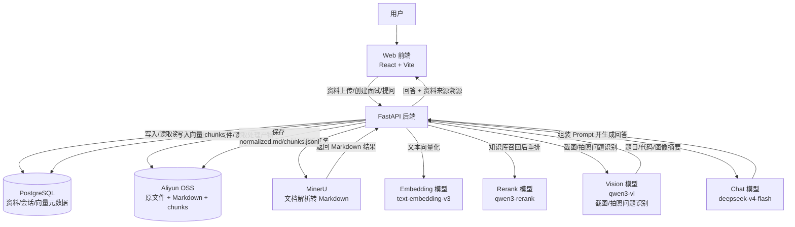

## 2. 核心原则

```text
前端资料列表 = 后端数据库资料状态的展示
后端数据库 = 用户可见资料、处理状态、可选状态、会话快照的事实源
OSS = 原文件和处理产物的对象存储
RAG = 只用于知识库资料
简历/JD = 面试回答时作为固定 Prompt 上下文
```

前端不直接列 OSS bucket，也不把浏览器本地状态当作真实资料库。OSS 中一份资料通常会对应多个对象，所以 OSS 对象数量和前端资料数量不会一一相等。

## 3. 资料上传与后端能力化流程

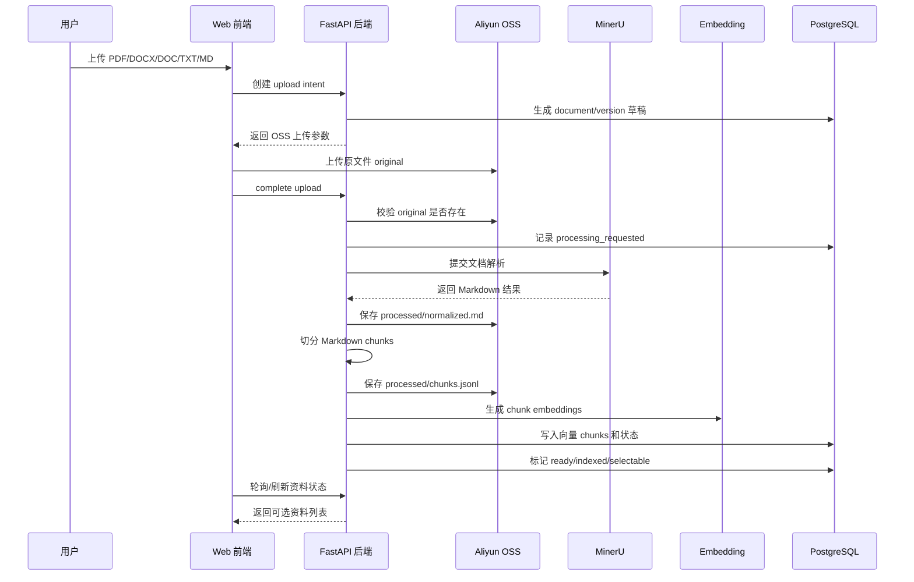

资料库阶段负责重处理，包括 OSS 校验、MinerU 转换、Markdown 归一化、chunk、embedding、向量入库。创建面试阶段不应该重新跑这些重活。

## 4. OSS 路径设计

当前建议路径结构：

```text
materials/{env}/users/{user_hash}/documents/{kind}/{document_id}/versions/{version_id}/original/{object_id}.{ext}
materials/{env}/users/{user_hash}/documents/{kind}/{document_id}/versions/{version_id}/processed/normalized.md
materials/{env}/users/{user_hash}/documents/{kind}/{document_id}/versions/{version_id}/processed/chunks.jsonl
materials/{env}/users/{user_hash}/documents/{kind}/{document_id}/versions/{version_id}/deleted/{timestamp}.json
```

示例：

```text
materials/development/users/3c92.../documents/resume/document-xxx/versions/version-yyy/original/abc.pdf
materials/development/users/3c92.../documents/resume/document-xxx/versions/version-yyy/processed/normalized.md
materials/development/users/3c92.../documents/resume/document-xxx/versions/version-yyy/processed/chunks.jsonl
```

### 一份前端资料为什么对应多个 OSS 对象

```text
前端显示：
大模型算法.pdf

后端 document/version：
document_id = document-xxx
version_id = version-yyy
kind = resume 或 knowledge

OSS objects：
original/*.pdf
processed/normalized.md
processed/chunks.jsonl
```

所以前端资料数量和 OSS 对象数量不相等是正常的。真正要保证的是：前端每条资料都能在后端找到 document/version，后端每条 ready/selectable 资料都能找到必要 OSS artifacts。

## 5. 数据库职责

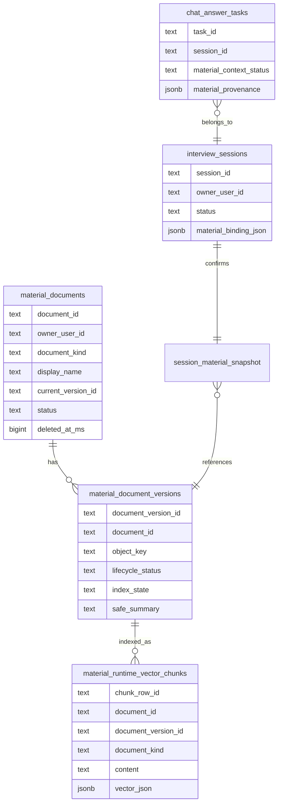

数据库保存：

- 用户资料条目。
- 当前版本。
- OSS object key。
- 处理状态。
- 索引状态。
- 是否 selectable。
- 面试 session。
- 本场资料快照。
- 回答任务和资料来源溯源。

## 6. 前端、数据库、OSS 同步关系

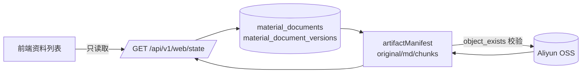

同步状态建议：

```text
synced             后端记录和 OSS 必要产物一致
processing         资料仍在上传、解析、切分或索引中
missing_artifacts  DB 有记录，但 OSS 必要产物缺失
deleted            DB 已删除或不可选
unknown            尚未校验
```

## 7. 删除流程

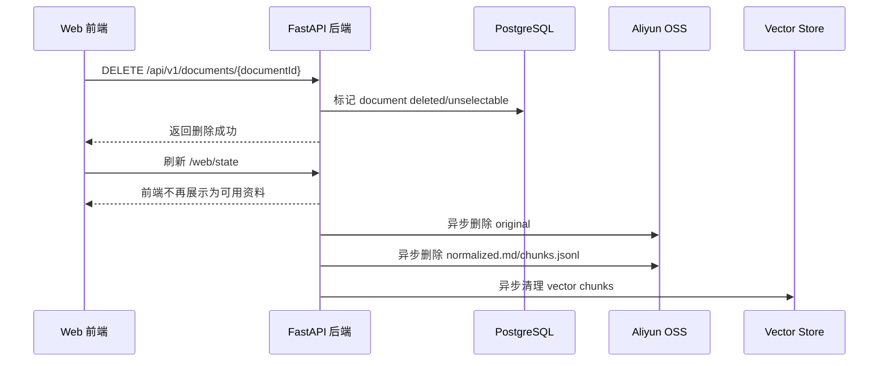

删除的关键原则：

```text
用户点击删除后，数据库立即变成 deleted/unselectable。
OSS 清理可以异步重试。
即使 OSS 删除失败，前端也不能继续把该资料展示为可用。
```

## 8. 创建面试与资料绑定流程

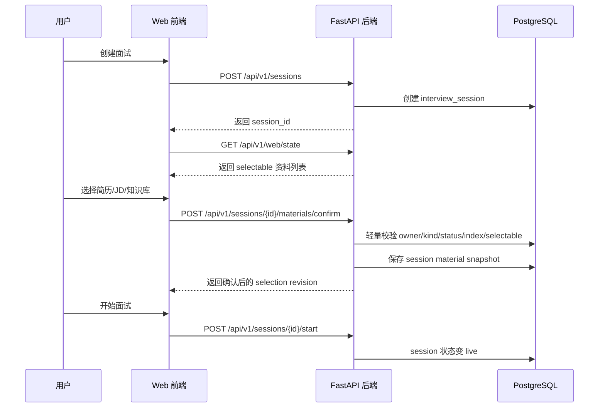

这里不应该同步执行：

```text
MinerU 转换
Embedding 构建
向量索引重建
大范围 OSS 扫描
```

否则绑定资料会慢。

## 9. 回答阶段 RAG 与 Prompt 组装

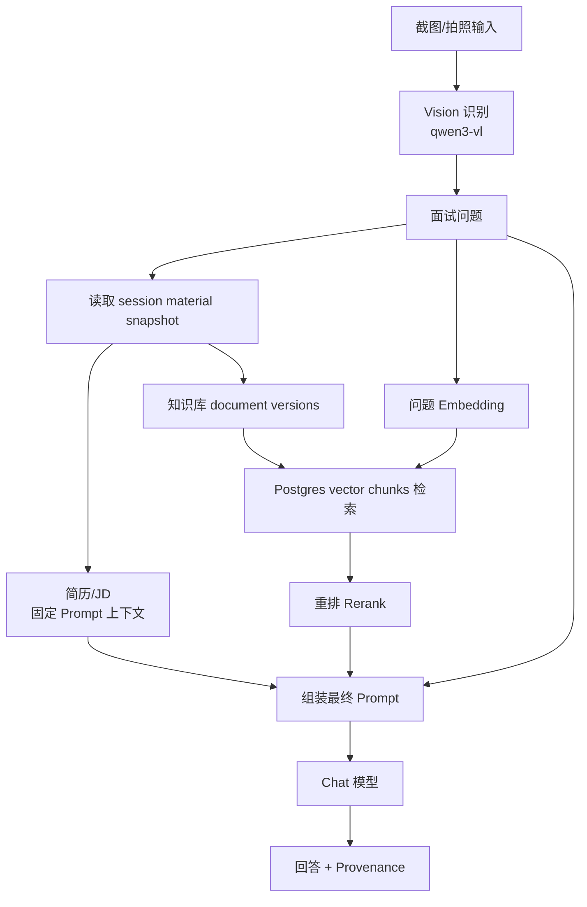

### 资料使用边界

```text
简历 Resume:
作为固定上下文进入 Prompt，不默认走 RAG。

职位 JD:
作为固定上下文进入 Prompt，不默认走 RAG。

知识库 Knowledge:
通过 embedding 检索 + rerank 后进入 Prompt。
```

这就是为什么 `retrievedSourceCount = 0` 不代表简历/JD 没用。简历/JD 应该看 `fixedSourceCount`。

### 截图/拍照识别边界

```text
qwen3-vl:
用于截图、拍照、代码题、系统设计图或网页题目的视觉识别。
输出应是题目文本、代码摘要、图像结构化描述或截图问题摘要。

Chat 模型:
用于结合问题、简历/JD 固定上下文、知识库 RAG 上下文生成回答。

二者不应混用:
Vision 模型负责“看图理解问题”，Chat 模型负责“基于资料组织回答”。
```

截图回答推荐链路：

```text
截图/拍照
-> qwen3-vl 识别题目和关键视觉内容
-> 后端合成 normalized question
-> 读取本场简历/JD 固定上下文
-> 对已选知识库做 RAG 检索
-> Chat 模型生成回答
-> 返回回答和资料来源溯源
```

## 10. 回答来源溯源

每次回答应返回：

```json
{
  "materialContextStatus": "ready",
  "fixedSourceCount": 2,
  "retrievedSourceCount": 3,
  "materialProvenance": {
    "usedSources": [
      {
        "kind": "resume",
        "displayName": "大模型算法.pdf",
        "contextRole": "fixed"
      },
      {
        "kind": "jd",
        "displayName": "高级算法工程师 JD",
        "contextRole": "fixed"
      },
      {
        "kind": "knowledge",
        "displayName": "大模型算法知识库",
        "contextRole": "retrieved",
        "retrievalCount": 3
      }
    ],
    "unavailableSources": []
  }
}
```

前端展示建议：

```text
已引用本场资料 · 固定资料 2 · 知识库 3
来源：简历 / JD / 知识库
```

无资料时：

```text
本次回答未引用已选资料
```

资料失效时：

```text
部分已选资料不可用：normalized.md 缺失 / chunks 缺失 / 向量索引缺失
```

## 11. 当前链路的目标状态

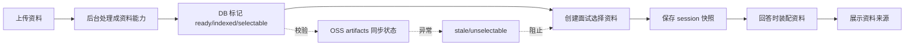

最终要达成：

```text
资料库上传慢一点可以接受，因为那是后台能力构建。
创建面试绑定资料必须快，因为只绑定已构建好的能力。
回答必须可靠，因为只使用本场确认快照。
前端必须可信，因为只展示后端事实源。
OSS 必须可审计，因为每个 ready 资料都有 artifactManifest。
```

## 12. 典型问题解释

### 为什么 OSS 里对象数量和前端资料数量不一样？

因为前端展示的是资料条目，OSS 存储的是这条资料的多个产物：

```text
1 条资料 = original + normalized.md + chunks.jsonl
```

### 为什么上传到 OSS 后前端没显示？

可能原因：

```text
OSS 有对象，但后端没有 document record。
上传 complete 没成功。
资料还在 processing。
资料处理失败。
后端判断 missing_artifacts，标记不可选。
```

### 为什么创建面试选择资料后回答没用？

可能原因：

```text
资料没有确认到 session material snapshot。
资料不是 ready/indexed/selectable。
回答问题和知识库内容不相关，RAG 没命中。
简历/JD 缺少 normalized.md，固定上下文加载失败。
用户问的是个人经历，但只选择了知识库，没有选择简历/JD。
```

### 为什么绑定资料不能每次扫 OSS？

因为创建面试是高频、低延迟动作。OSS 扫描、MinerU、Embedding 都属于重操作，应该发生在资料库后台处理阶段，而不是面试开始前。

## 13. 商业化目标架构补强

在当前原型闭环之上，商业化版本建议调整为以下分层：

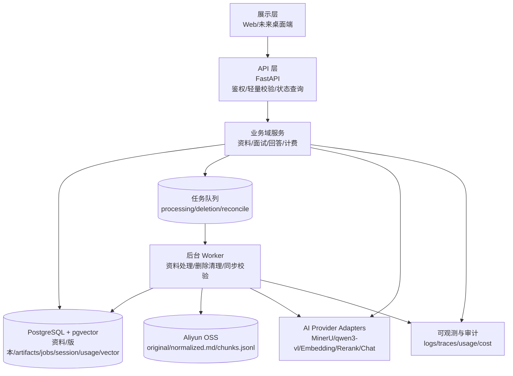

### 13.1 API 与 Worker 职责边界

```text
API 层：
- 创建 upload intent
- 确认上传完成
- 创建面试 session
- 轻量确认本场资料
- 查询资料状态
- 启动回答任务
- 返回回答结果和 provenance

Worker 层：
- MinerU 文档解析
- Markdown 归一化
- chunks.jsonl 生成
- Embedding 构建
- 向量入库
- OSS/DB 同步校验
- 删除任务清理 OSS 和向量
- 失败任务重试
```

商业化要求是：用户请求路径不能被大 PDF、MinerU 超时、Embedding 超时或 OSS 清理失败阻塞。

### 13.2 数据库建议新增/固化的表

```text
material_artifacts
- artifact_id
- owner_user_id
- document_id
- document_version_id
- artifact_kind: original | normalized_markdown | chunk_manifest | deletion_marker
- object_key
- content_type
- size_bytes
- sha256
- sync_status: synced | missing | deleted | unknown
- verified_at_ms
- created_at_ms
- updated_at_ms

material_processing_jobs
- processing_job_id
- owner_user_id
- document_id
- document_version_id
- stage: parsing | normalizing | chunking | embedding | indexing
- status: queued | running | succeeded | failed | retrying | cancelled
- retry_count
- max_retries
- safe_error_code
- created_at_ms
- updated_at_ms
- started_at_ms
- completed_at_ms

material_deletion_jobs
- deletion_job_id
- owner_user_id
- document_id
- document_version_id
- target_object_keys
- vector_cleanup_filter
- status
- retry_count
- safe_error_code
- created_at_ms
- completed_at_ms

ai_usage_records
- usage_id
- owner_user_id
- session_id
- related_task_id
- operation_kind: parser | vision | embedding | rerank | chat
- provider
- model
- prompt_tokens
- completion_tokens
- total_tokens
- point_cost
- trace_id
- created_at_ms

rag_retrieval_traces
- trace_id
- owner_user_id
- session_id
- question_hash
- filter_document_version_ids
- candidate_count
- reranked_count
- returned_count
- created_at_ms
```

这些表不是为了复杂而复杂，而是为了商业化后的计费、排障、审计、删除合规和成本控制。

### 13.3 模型职责边界

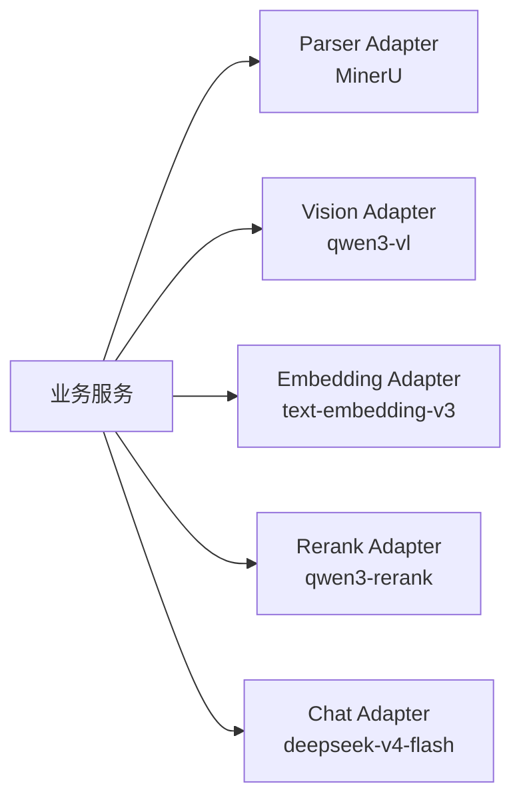

模型职责：

```text
MinerU：文档解析，把 PDF/DOCX/DOC/TXT/MD 统一变成 Markdown。
qwen3-vl：截图、拍照、代码图、系统设计图识别，输出 normalized question。
text-embedding-v3：知识库 chunk 向量化和问题向量化。
qwen3-rerank：对知识库召回片段重排。
deepseek-v4-flash：结合问题、简历/JD 固定上下文、知识库 RAG 上下文生成回答。
```

Vision 模型和 Chat 模型不应混用。截图回答也应先由 qwen3-vl 识别题目，再进入统一回答链路。

### 13.4 商业化关键非功能目标

```text
一致性：
前端资料列表只展示后端 DB 状态；ready/selectable 必须有 artifactManifest 支撑。

性能：
创建面试和绑定资料只做 DB 轻量校验，不执行重型 OSS/MinerU/Embedding 任务。

可恢复：
processing/deletion/reconcile 都必须有 job 状态和 retry_count。

可观测：
每次模型调用、RAG 检索、资料处理、删除清理都要有 trace id。

计费：
Parser、Vision、Embedding、Rerank、Chat 的用量需要进入 ai_usage_records。

隐私：
日志、trace、usage 不记录简历全文、JD 全文、截图原图、完整 Prompt 或 embedding。

安全：
所有 DB 查询、OSS object key、RAG filter、session material binding 都必须按 owner_user_id 限制。
```

### 13.5 推荐演进路线

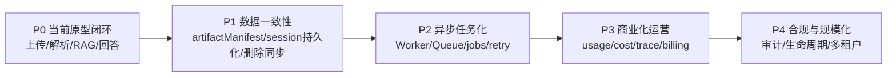

## 14. Commercial hardening implementation notes

This pass adds the commercial architecture foundation without changing the current prototype layout.

API responsibilities:

- Create upload intents and confirm backend-issued OSS object keys.
- Persist material document/version metadata and original artifact manifests.
- Enqueue durable processing/deletion job records while keeping lightweight API responses.
- Confirm interview material selection only from owner-scoped, selectable document records.
- Return library state with persisted artifact manifest first, and legacy OSS-path verification as fallback.

Worker responsibilities:

- Run independently from the API process via `PYTHONPATH=apps/backend python -m app.worker`.
- Process durable deletion and reconciliation jobs with safe retry state.
- Keep provider payloads, resume/JD text, screenshots, full prompts and embeddings out of logs and job payloads.

Database additions:

- `material_artifacts`: explicit original, normalized Markdown, chunk manifest and cleanup artifact records.
- `material_processing_jobs`, `material_deletion_jobs`, `material_reconcile_jobs`: durable job state with stage, retry count, max retries, safe error code and timestamps.
- `ai_usage_records`: safe provider usage records for parser, vision, embedding, rerank and chat operation families.
- `rag_retrieval_traces`: query hash, owner/session, confirmed filter scope, candidate/rerank/return counts and returned source IDs.

Model boundary:

- MinerU remains the parser adapter for document-to-Markdown conversion.
- qwen3-vl remains the Vision adapter for screenshot/photo question recognition.
- Embedding and rerank adapters remain isolated to the Knowledge RAG path.
- Chat remains responsible only for final answer generation using fixed Resume/JD prompt context plus retrieved Knowledge context.

Local worker command:

```bash
PYTHONPATH=apps/backend python -m app.worker --once
PYTHONPATH=apps/backend python -m app.worker --interval-seconds 2
```

The prototype still starts the existing in-process document processing thread after upload so the current UX remains fast during development. The durable job tables now provide the commercial source of truth for observability, retries and future full API/Worker separation.
