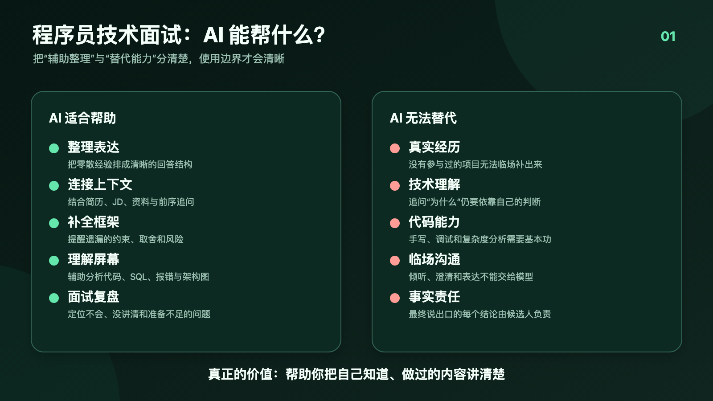
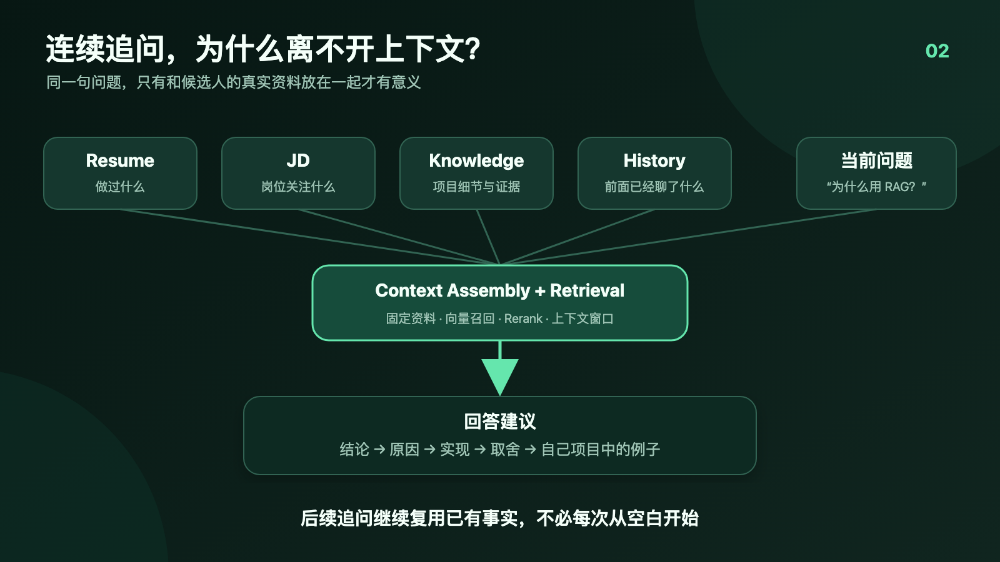
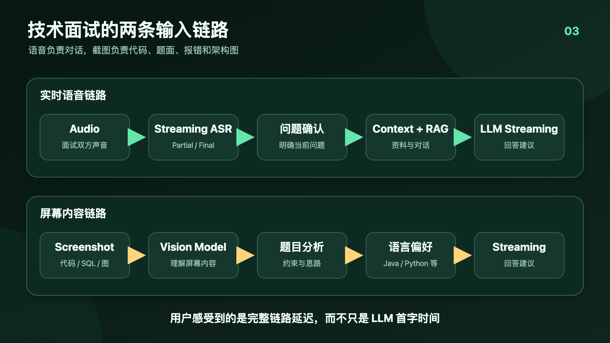

# 程序员技术面试时，AI 到底能帮上什么忙？

程序员面试有一个挺奇怪的现象。

很多问题其实不是完全不会。

Redis 看过，MySQL 看过，JVM 背过，项目也是自己做的。但面试官突然追问：

> 你这个项目为什么要用 RAG？
>
> 为什么选择向量检索？
>
> 如果数据量扩大十倍怎么办？
>
> 这个方案最大的瓶颈是什么？

脑子里明明有不少相关信息，一到现场却不知道从哪里开始讲。

有时是紧张，有时是问题换了一种问法，有时是知道结论，却没有整理过推导过程。回答说到一半，面试官再往下追两层，原来的表达结构就散了。

这也是我做 AI 面试助手之后越来越明确的一点：

**AI 在技术面试里真正有价值的地方，不是替你回答一个完全不会的问题，而是帮助你快速整理自己原本就知道、做过，但暂时没有组织好的内容。**



程序员面试不是一次简单的知识问答。它通常包含简历准备、项目追问、技术基础、系统设计、算法题、行为面试和面试复盘。不同阶段需要的帮助完全不同。

## 一、项目经历：通用答案很容易，结合自己的项目回答很难

技术面试最常见的情况，是面试官沿着简历不断追问：

- 这个项目里你负责什么？
- 为什么采用这个架构？
- 为什么选这个模型或中间件？
- 当时还有哪些备选方案？
- 线上出现过什么问题？
- 如果重新做一次，你会怎么改？

这些问题没有一份适合所有人的标准答案。

例如，同样是“为什么使用 RAG”，做企业知识库的人、做客服系统的人、做代码检索的人，答案应该完全不同。即使技术链路相似，数据规模、时效性、召回要求和成本约束也不一样。

普通大模型只看到一句问题：

```text
为什么使用 RAG？
```

它往往会生成一段正确但很泛的回答：降低幻觉、补充外部知识、提高准确性。这样的内容适合科普，却不一定适合面试。

更有效的输入应该是：

```text
当前问题
+ 简历
+ 职位描述
+ 项目资料
+ 前面的对话
```

简历告诉 AI 候选人实际做过什么，JD 决定回答应该突出哪些能力，项目资料提供技术细节，前面的对话则决定当前追问是在延续哪个话题。

我在开发面试稳时，也把这几类上下文分开处理。简历和 JD 作为相对固定的上下文；知识资料则通过 Embedding、向量检索和 Rerank，找到与当前问题相关的片段，再交给 LLM 组织回答。

这里有一个很重要的边界：检索到的资料只能帮助还原已有事实，不能替候选人编造经历。没有出现在材料里的公司、职责、指标和项目成果，不应该被 AI 补出来。

对项目面试来说，AI 最有用的能力不是“生成一个听起来高级的项目”，而是把你真正做过的事情整理成一条清晰的表达链路：

```text
业务背景
→ 遇到的问题
→ 方案选择
→ 具体实现
→ 技术取舍
→ 最终结果
→ 后续改进
```

## 二、技术八股：定义只是起点，面试官更想听你怎么理解

Java、MySQL、Redis、JVM、Spring、计算机网络、操作系统，以及现在越来越常见的 LLM、RAG、AI Agent，确实都有大量需要准备的知识点。

AI 很适合帮助整理这些内容，但不能只是替你背答案。

例如面试官问：“什么是 RAG？”

如果回答只有一句“RAG 是检索增强生成，通过外部知识降低大模型幻觉”，只能说明你记得定义。

一个更完整的回答可以按下面的结构展开：

1. RAG 是什么；
2. 为什么需要 RAG；
3. 数据如何切分和建立索引；
4. Retrieval 如何召回候选内容；
5. 为什么可能还需要 Rerank；
6. 检索结果如何进入 LLM；
7. 自己在项目里怎么使用；
8. 遇到过哪些召回、延迟或上下文问题。

AI 可以快速生成这套结构，也可以提醒你缺少了哪一层。但每一层的项目事实仍然需要由你提供。

技术面试真正拉开差距的，往往不是能不能说出定义，而是能不能回答：

> 这个原理和你的项目有什么关系？

如果一个知识点从来没有真正理解过，只是在面试现场看到一段生成内容，面试官继续问“为什么”，通常两三轮就会暴露。

## 三、连续追问：面试不是一组互不相关的题目

刷题时，每道题通常是独立的。真实面试不是。

面试官可能沿着一个问题一直往下问：

```text
为什么使用 RAG？
↓
为什么不用长上下文？
↓
Embedding 模型怎么选？
↓
Chunk 怎么切？
↓
召回不准确怎么办？
↓
为什么需要 Rerank？
↓
线上延迟怎么优化？
```

后一个问题依赖前一个回答。如果 AI 每次只拿到当前这句话，它就不知道“召回”指的是哪个系统，也不知道候选人刚才已经选择了什么方案。

所以 Conversation Context 对实时面试辅助很重要。



在当前实现里，回答生成会带上最近的会话上下文，让后续问题能够延续前面的讨论。知识检索也会围绕当前问题和会话状态进行，而不是每次从完全空白的状态重新回答。

不过，上下文也不能无限堆积。内容太多会增加延迟，还可能把已经不相关的话题带进当前回答。工程上需要控制上下文窗口，只保留与当前追问最有关的内容。

这类能力有一点 AI Agent 的味道：系统需要根据问题选择上下文、检索资料并生成建议。但在面试场景里，我更倾向于保留明确的用户触发和确认，而不是让系统在后台自动替用户不断做决定。

## 四、系统设计：AI 更适合提供检查清单

系统设计题最容易出现一种情况：候选人知道很多组件，却不知道应该先讲什么。

例如“设计一个秒杀系统”，一上来就谈 Redis、MQ 和分布式锁，面试官可能会反问：

> 你预计有多少用户？库存规模是多少？一致性要求是什么？

系统设计首先应该明确约束，然后再选择方案。一个比较稳定的回答框架是：

```text
需求澄清
→ 规模估算
→ 核心数据模型
→ 总体架构
→ 关键链路
→ 性能瓶颈
→ 稳定性
→ 扩展性
→ Trade-off
```

AI 在这里很适合作为检查清单。

它可以提醒候选人还没有确认流量规模，没有解释缓存和数据库的一致性，没有说明消息重复消费怎么处理，也没有讨论降级方案。

但它不适合直接生成一大段让人照着念的系统设计答案。系统设计的重点恰恰在讨论和取舍。面试官改变一个条件，原来的方案就可能不再成立。

真正有价值的辅助，应该帮助候选人看清当前讨论到了哪一步，以及下一步还需要补充什么。

## 五、算法题和代码题：语音链路看不到屏幕

技术面试不只有语音。

面试官可能在屏幕上展示：

- LeetCode 题目；
- SQL 查询；
- Java、Python 或前端代码；
- 一张系统架构图；
- 一段错误日志；
- 一张算法题截图。

Streaming ASR 只能知道双方说了什么，看不到题目中的代码、图表和约束。

这需要另一条视觉链路：

```text
Screenshot
→ Vision Model
→ 理解题目
→ 分析
→ 回答建议
```

面试稳当前的截图回答也是沿着这条链路处理：桌面端截取当前屏幕内容，上传后交给视觉模型分析，再以流式方式返回结果。

当前这条截图链路主要依据截图内容和用户选择的编程语言生成建议，不会自动把简历、JD 和知识库全部混入答案。这样输入边界比较明确，也能减少不相关的个人资料对代码题判断的干扰。

它可以帮助识别题目、分析思路和整理回答，但不等于自动运行代码，也不能替代候选人的编码过程。面试官一旦要求手写、调试或解释复杂度，最终仍然要靠自己的代码能力。

## 六、实时回答为什么比想象中复杂

很多人会把实时 AI 面试辅助理解成：

```text
问题
→ ChatGPT
→ 答案
```

实际链路更接近：

```text
Audio
→ Streaming ASR
→ 问题确认
→ Conversation Context
→ Retrieval
→ LLM
→ Streaming Answer
```

如果是屏幕题，还要走独立的截图和视觉模型链路。



用户感受到的延迟，是从面试官说完问题，到第一段有用建议出现在界面上的总时间。它包含语音采集、ASR、问题确认、知识检索、模型生成、网络传输和前端渲染。

所以单独把 LLM 的首字延迟优化得很低，并不代表整个产品就会显得快。

我在上一篇《AI 面试助手是怎么做到实时回答的？我自己做了一个之后，聊聊完整技术链路》里专门拆过这部分。对普通使用者来说，只需要理解一点：实时辅助是一条完整链路，其中任何一个环节不稳定，最终体验都会受到影响。

## 七、AI 帮不了什么

这部分可能比“AI 能做什么”更重要。

AI 不能替代：

- 真正参与过的项目；
- 对技术原理的理解；
- 临场沟通和倾听；
- 面对连续追问时的判断；
- 架构方案中的 Trade-off；
- 实际编码和调试能力；
- 候选人经历的真实性。

如果一个问题完全不会，AI 临时生成一段答案，确实可能帮助说出第一层。但面试官继续问“为什么这样选”“有没有其他方案”“你实际踩过什么坑”，很快就会进入无法靠通用答案支撑的区域。

完全照着 AI 内容念，还会产生另一个问题：回答听起来很完整，却没有重点。面试官问的是你为什么这么做，回答却从技术定义讲到行业趋势，反而容易暴露对问题缺乏判断。

相反，如果这个项目确实是自己做的，技术也真正学过，只是现场紧张、表达顺序混乱，AI 帮助整理思路的价值会大很多。

AI 可以提醒你：

> 先说结论，再讲原因；
>
> 补充一下方案取舍；
>
> 把项目里的具体例子讲出来；
>
> 不确定的数据不要编。

但最后说什么、哪些内容属于自己的真实经验，仍然应该由候选人判断。

## 八、什么情况下，AI 最有价值？

我目前认为有五类场景比较实际。

### 1. 项目确实做过，但表达比较乱

AI 可以根据简历、JD 和项目资料，把零散信息整理成面试官容易理解的结构。

### 2. 技术知识知道，但临场组织不出来

它可以快速给出“定义、原理、实现、优缺点、应用场景、项目实践”的回答骨架。

### 3. 面试官突然换了一种问法

有时卡住并不是不会，而是没立刻理解问题想考什么。AI 可以帮助识别问题背后的考点。

### 4. 连续追问后思路断掉

保留会话上下文后，AI 可以帮助恢复当前讨论到了哪里，避免每次回答都从头开始。

### 5. 面试结束以后复盘

面试中没有答好的问题，往往比重新刷一套八股更值得复习。当前系统可以保留会话中的问题和回答建议，用于后续查看和导出；在用户明确允许保留转写内容的情况下，已有的对话记录也可以成为复盘材料。

复盘时真正值得关注的是：

- 哪些问题完全不会；
- 哪些知识点知道但没讲清；
- 哪些项目事实准备不足；
- 哪些回答缺少数据和结果；
- 哪些追问暴露了理解断层。

这也是 AI 面试辅助更长期的价值：不只服务于面试现场，还能帮助下一次准备得更具体。

## 九、我为什么做了“面试稳”

我在拆解这些技术面试场景时发现，单纯接入一个大模型并不能解决问题。

真正需要连接起来的是语音、屏幕、简历、JD、项目资料、会话上下文和面试后的复盘。

后来我把这些能力做成了一款面向求职者的 AI 面试助手，叫「面试稳」。当前版本提供实时面试辅助、简历和 JD 上下文、知识资料检索、回答建议、截图识别，以及面试记录的查看与导出，也覆盖程序员技术面试场景。

感兴趣的话，可以看看它的[程序员 AI 面试助手页面](https://mianshiwen.cn/features/ai-interview-assistant)。

我不认为 AI 能让一个完全没有准备的人突然通过高强度技术面试。它更适合帮助真正做过项目、学过技术的人，在有限时间里找到重点，把自己的思路表达清楚。

面试最终考察的仍然是候选人本人。AI 能做的，是在你卡住的时候，帮你把散落在脑子里的内容重新排好顺序。
