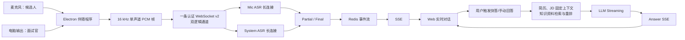

# AI 面试助手是怎么做到实时回答的？我自己做了一个之后，聊聊完整技术链路

看起来，AI 面试助手似乎就是“语音转文字 + LLM”。真正把它做成一个能在面试中持续工作的产品以后，我才发现，模型只是链路中的两段。采集会不会中断、音频有没有积压、一句话何时结束、临时字幕会不会倒退、答案能否用上候选人的真实资料，任何一处处理不好，用户看到的都是同一个结果：它怎么还没反应？

下面写的是我开发“面试稳”时真实走过的技术路线。它不是一张从白板上一次画对的架构图，而是一条被延迟、崩溃、重连和错误假设反复修正过的链路。

## 先看完整链路

当前语音主链路可以简化成这样：



截图回答走另一条路：Web 创建截屏任务，绑定的桌面端通过设备事件流取到任务，截图、压缩并上传，后端直接调用视觉模型流式生成答案，再通过任务事件和 SSE 回到 Web。它不依赖正在变化的语音转写，也不把“最近一句面试官的话”偷偷拼进截图题。

这里还有一个容易误解的产品行为：转写确认不会自动创建回答。当前实现要求用户点击快答、提交手动问题或发起截图回答。这样做牺牲了一点“全自动”的想象空间，却避免了连续语音反复触发答案、回答顺序错乱和费用失控。

## 为什么还要安装 Electron 伴随程序

如果只收麦克风，浏览器当然能做。但真实远程面试里，我需要同时知道两件事：面试官通过会议软件说了什么，以及候选人自己已经回答了什么。

当前生产路径由 Electron 负责采集。麦克风通过 `getUserMedia` 获取；电脑输出通过 display loopback 获取音轨，拿到音频后立即停掉不需要的视频轨。两路音频分别标记为 `microphone` 和 `system`，后端再稳定映射为“我”和“面试官”。它们不会先混成一条音频再猜说话人。

这种区分直接影响后续逻辑：问题候选主要来自面试官通道，候选人的发言用于保持对话上下文；一条通道异常时，另一条也可以继续工作。桌面端负责采集，Web 负责展示和交互，两者通过会话绑定解耦，所以页面刷新或换一个展示设备，不应该反过来夺走桌面的媒体采集租约。

音频进入 AudioWorklet 后，会被降采样为 16 kHz、单声道、PCM16，再按大约 100 毫秒的增量节奏进入分段器和发送队列。原始 PCM 只待在有界内存里，默认不写 Redis、PostgreSQL、OSS 或诊断文件。

## 第一个大坑：一个很小的 Float32Array，最后把 Electron 弄崩了

这可能是整个开发过程中最不像“AI 问题”的问题。

早期 AudioWorklet 每处理一个 128 sample 的 render quantum，就创建一个新的 `Float32Array`，再把 backing buffer 转移给 Renderer。48 kHz 下，每个声道大约每秒发生 375 次跨线程传输。双声道长时间运行后，问题不再是“多分配了一点内存”。五份 macOS crash report 显示，相同版本的 Renderer 都以 `EXC_BREAKPOINT/SIGTRAP` 退出，崩溃前积累了大约 13 万到 26.6 万个虚拟内存区域。主进程还活着，所以用户重新打开窗口时，只看到一块黑屏。

最后的修法并不复杂：Worklet 内部先累计 1024 samples，再转移一个完成的 buffer。这样单次增加约 21～23 毫秒采集等待，但传输频率降到每声道每秒约 43～47 次。30 分钟双声道合成 soak 中，传输次数从旧算法估算的 135 万次降到 168750 次，减少 87.5%。同时，音量表和健康状态最多以 10 Hz 更新，不能让 React 跟着音频回调频率重绘。

这次修复也让我补上了 Renderer watchdog：看 AudioWorklet 回调是否还在、是否有待确认帧、ACK 是否推进。`capturing=true` 只代表产品希望采集，不能证明媒体管线真的活着。

修完崩溃后，我又碰到了更夸张的问题：一次真实观察中，网络进程 20 分钟发出了约 4.95 GB 数据。后来加上逐声道诊断才确认，某次故障里 1634 个唯一系统音频帧触发了 1253984 次 WebSocket 写入，原因是每次收到 sequence gap 都清空 sent 集合，再把整个队列重放。

现在的传输规则变成了：每个逻辑通道最多 8 个未确认帧；服务端 ACK 连续序号；出现 gap 时只补发服务端明确要求的那一帧；相同 gap 500 毫秒内去重；单序号最多补发 3 次。若本地已经找不到缺失帧，就明确丢弃不可恢复的小段，创建新的 publisher 身份，从最新音频继续，而不是进入无限重放风暴。

## Streaming ASR 的关键不是“流式”，而是连接生命周期

桌面到后端是一条认证 WebSocket，里面复用 Mic 和 System 两个逻辑通道。后端为每个来源维护独立的有界队列和 ASR session。桌面断线后会指数退避重连，并根据后端返回的 `resumeOffsets` 清掉已确认帧，再发送仍然有效的未确认帧。

后端到 ASR 服务商则是另一层 WebSocket。早期我以为已经做了“长连接复用”，但一次线上 Trace 直接打脸：麦克风有 103 次 commit，却创建了 105 次连接；系统音频 90 次 commit、89 次连接。原因是桌面每开始一段新语音都会增加 `sourceGeneration`，而网关当时把 generation 也放进了复用条件，效果等同于几乎每句话重新握手。

后来复用键改为 interview session + source kind。一场面试中，Mic 和 System 各自保留一条 ASR 连接，commit 只结束当前 utterance，不关闭 socket。真实 macOS 连续播放 12 分 19 秒的验证里，System 新增了 62 个 utterance，测试窗口内连接创建为 0、重连为 0，全部复用了预热连接；该后端进程累计约 115 个 utterance / 2 条 System 连接。

代码里有 Heartbeat，但要把概念说清楚：Web 页面和桌面设备会定期向后端更新 lease，SSE 空闲时也会发 keepalive；我没有在当前 ASR 网关中找到一套自定义应用层 Ping/Pong 协议，所以不会把它写成已经实现。ASR 连接的失效主要由收发异常、超时和会话状态处理。

## 最难的其实是：什么时候算一句话结束

不能等整句话结束才把音频送给 ASR，否则“实时”从一开始就不存在。当前桌面会持续发送增量 PCM，ASR 返回完整的临时假设 Partial；当本地判断一句话结束，再按顺序送完最后一批 PCM，发送 `input_audio_buffer.commit`，等待服务商的 completed / Final。

这里没有一个我可以吹成“语义 Endpoint Controller”的模块。生产默认仍是 manual commit，边界主要来自本地能量判断：动态噪声底、起音阈值、持续阈值、attack、静音 tail 和最大句长。当前保守 tail 上限是麦克风 480 毫秒、系统音频 350 毫秒；环境确实回到清晰静音时，可分别缩短到 280 和 220 毫秒。系统音频还会观察短窗口内的能量变化，避免视频背景声或数字底噪一直把一句话续到最大时长。

我也真实比较过 Server VAD。2026 年 8 月的一次同音频测试中，manual 路径停止说话到 Final 约 797 毫秒；Server VAD 在 8 秒观察窗口内仍没有完成，只拿到不完整 Partial。所以当前没有为了“听起来更先进”强行切到云端 VAD。

本地静音成立，也不代表 Final 已经到了。commit 之后，服务商仍可能继续修正尾词，后端会在有界时间内等待 completed；Web 先把这一行显示为 committing，停止闪烁的输入光标，等权威 Final 再做最终校正。如果连接异常或 Final 缺失，后端 watchdog 会把这一段收口为 incomplete，而不是让它永远停在“正在转写”。

## Partial 为什么会跳，甚至越变越短

Streaming ASR 的 Partial 不是新增的几个字，而是服务商对当前 buffer 的完整假设。假设它依次返回：

```text
请介绍项目
请介绍项目的性能优化
请介绍项目
请介绍项目的性能优化方案
```

如果前后端只是看到更大的 revision 就整行覆盖，第三次更新会让用户已经看到的“性能优化”突然消失。这正是项目里真实发生过的字幕回缩 bug，Git 历史里甚至留下了修复、调整和回滚的过程。

现在后端和 Web 都做同样的可见文本稳定规则：非 Final 的更短假设不能擦掉当前更长文本；相同或更长的修订立即更新；迟到的 Partial 不能覆盖已经 Final 的段。Final 原则上是权威结果，可以纠正较长但错误的临时文本；但如果 Final 只是当前文本的严格前缀，系统把它视为截断式 commit，保留用户已经看到的完整前缀。

这不是在修改 ASR 识别结果，而是在区分“供应商解码窗口暂时回缩”和“最终纠错”。没有 revision、segmentId 和 terminal state，这件事做不稳。

## 为什么问题不能直接丢给 LLM

同一个问题，“讲讲你做过的性能优化”，对不同候选人应该有完全不同的答案。只给模型问题，它很容易生成一个结构正确、经历却不属于你的回答。

当前资料链路把上下文分成两类。简历和 JD 是本场会话确认后的固定上下文，生成回答时直接装配；知识资料才走 RAG：问题 embedding、按 owner 和本场 document/version allowlist 过滤、向量召回、rerank，最后把少量证据片段交给详细回答模型。没有命中或资料不可用时，Prompt 明确要求不能编造公司、项目、职责、结果和数字。

这里还有一个值得公开的实现差距。仓库已经启用 pgvector，正式迁移中也有 `vector(1536)` 和 IVFFlat cosine index；但当前实际注入的 `PostgresRuntimeVectorStore` 把向量保存在 `vector_json JSONB`，读取候选行后在 Python 中计算 cosine similarity。也就是说，pgvector 基础设施和目标表结构已经存在，当前运行时检索还没有真正使用数据库向量算子。这是后续数据量增大后需要继续收敛的方向，不能写成已经完成的生产能力。

为了让首字更快，回答也不是简单串行的“RAG 全做完再调用 LLM”。当前流式回答先用固定资料生成简要回答；模型完成问题归一化后，详细知识检索可以并行预取；随后详细回答再带上简历、JD、知识检索结果和简要回答锚点继续流式生成。Answer SSE 负责首字和后续 chunk，会话 SSE 负责任务状态与断线恢复。

## 用户感知延迟，不等于 LLM latency

我最早也容易盯着模型耗时看。后来发现，用户等的是：

```text
声音出现
→ 桌面检测并发送
→ 后端接收与排队
→ ASR append
→ 首个 Partial / Final
→ Redis XADD / XREAD
→ SSE send
→ 浏览器读取、状态更新、React commit、paint
→ 用户点击回答
→ 上下文装配 / 检索 / 重排
→ LLM 首 token
→ Answer SSE
→ 页面首次显示
```

2026 年 7 月的一次旧基线里，ASR 首字约 677 毫秒，但第一个可见 Partial 要 2529 毫秒。真正的大头是桌面端已经积压约 1 秒，说明模型还没收到用户刚说完的音频。改成长连接传输后，真实 manual 样本里 capture-to-send 降到 2 毫秒，停止说话到 Final 约 797 毫秒。

生产聚合也必须看口径。2026 年 8 月 20 日报告中的 774 次 ASR Final 全部成功，模型阶段平均 251 毫秒、P95 367 毫秒；22 次文本回答首字平均 888 毫秒、P95 991 毫秒，但完整答案 P95 是 24.44 秒。这些数字分别是模型阶段和回答任务指标，不包含每次物理收音到浏览器绘制的完整链路，不能拿来宣传“端到端只要 367 毫秒”。

## 为什么最后要做 T0–T11 Trace

当“字幕慢”只是一条用户反馈时，ASR、网络、队列、Redis、SSE 和浏览器谁都像嫌疑人。于是我把一次字幕更新拆成从语音活动、桌面真实 WebSocket send、后端 receive、Qwen append/Partial、Redis XADD/XREAD、SSE yield，到浏览器 chunk、解析、store、React commit 和 paint 的连续时间点。仓库里的文档沿用 T0–T11 这个名字，当前代码实际上已经把浏览器内部阶段拆得更细。

这套 Trace 纠正过好几次误判。12 轮真实 Qwen + Redis + SSE 热路径测试里，Qwen append 到首个 Partial 的 P50/P95 是 437/447 毫秒；Redis XADD 到 XREAD 的 P95 只有 1 毫秒，XREAD 到 SSE send 的 P95 只有 2 毫秒。它说明这组样本里重写 Redis 或盲目加 worker 没有意义。

另一个教训是，埋点必须落在真实边界。早期 `sentAtMs` 在帧进入本地队列时就记录，报告里的“发送到后端”因此混入了桌面排队时间，不能被解释成公网 RTT。后来 T1 才移到真正的 `WebSocket.send`。如果时间戳本身放错了位置，越精确的百分位只会给出越自信的错误答案。

同一轮还发现：Qwen 接收线程已经拿到 Partial 后，应用要等下一帧 append 才把它取出，平白增加 P50 61 毫秒、P95 84 毫秒。于是 Partial 改为从 receive pump 直接进入字幕发布支路，后续探针里的 Qwen Partial 到 Redis XADD 降到约 2 毫秒。

Trace 也暴露了测量本身的陷阱。一次 12 分钟真实系统音频测试只拿到 11 条完整浏览器 ACK，观测到的 T0 到浏览器首个 Partial P50 是 12.629 秒；但页面可能在后台，59 个首 Partial 只有 11 个完成全链路关联。这个数是真实观测，却不能当作前台用户的正式 P50。工程上最危险的不是指标难看，而是把样本不足的局部数字包装成结论。

## 截图题为什么要单独做一条视觉链路

截图题可能是代码、表格、图表或网页题面。硬把它塞进语音链路，会让题目识别依赖一段本来就不稳定的口述。

当前流程是：Web 创建 capture request，并先显示处理中；桌面通过认证设备 SSE 收到任务，失败时才退回单次非重叠轮询；同一时间只允许一笔截图；Electron 截取当前屏幕，压缩成 JPEG，再 multipart 上传；后端记录 requested、claimed、uploaded、vision-running、completed/failed 等阶段；视觉模型直接流式输出可见答案，Web 通过事件流更新。

这里也有很现实的性能账。历史受控样本把 2.25 MB 原图压到约 91.5 KB，桌面压缩只花约 0.14 秒；正常样本中视觉模型约 13.4～13.6 秒，OSS 写入约 3 秒。最近 24 小时的 6 个生产视觉任务全部成功，视觉阶段平均 10.23 秒、P95 12.09 秒。截图回答的主要等待不在截图按钮和 JPEG 压缩，而在视觉生成与前置对象写入。

后续我又显式关闭了视觉模型的 thinking 模式，并分别记录“模型请求到首个可见正文”和“用户发起截图到浏览器首次渲染”。因为一个模型即使正在推理，如果没有输出可见正文，用户看到的仍是一块空白。

## 做完以后，我对 AI 面试助手最大的认识

AI 面试助手不是把 ASR 和 ChatGPT 接在一起就结束了。它更像一个有实时约束的多模态系统：桌面媒体采集是输入设备层，WebSocket 和 ACK 是传输层，Partial/Final/commit 是流状态机，RAG 是个人事实边界，LLM 和视觉模型是生成层，SSE 与前端归并决定结果什么时候真正被人看见。

真正决定体验的，通常不是某个模型排行榜上的单项分数，而是五件事能否一起成立：音频持续可用；两路角色不混乱；句尾既不拖也不截；个人上下文不编造；从声音到像素的每一段延迟都能被测量。

面试稳是我围绕这些问题持续开发的一款 AI 面试助手，目前已经有实时面试辅助、简历/JD 上下文、知识资料检索、流式回答建议、截图识别和面试复盘等能力。感兴趣可以看一次官网：[mianshiwen.cn](https://mianshiwen.cn)。我更希望这篇复盘留下的，不是“又一个 AI 产品”的印象，而是一条可以被核对、被质疑、也能继续优化的工程链路。

---

## 推荐标题

1. **AI 面试助手是怎么做到实时回答的？我自己做了一个之后，聊聊完整技术链路**
2. **我做 AI 面试助手踩过的坑：从双路音频、Streaming ASR 到 RAG 与 SSE**
3. **一次真实的实时 AI 系统复盘：为什么“ASR + LLM”远远不够**

## 100 字以内摘要

从 Electron 双路音频、WebSocket 与 Streaming ASR，到 Partial 回缩、句尾判断、RAG、LLM Streaming、截图视觉链路和 T0–T11 Trace，复盘我开发面试稳时遇到的真实故障、指标与技术取舍。

## 推荐知乎话题

- 人工智能
- 大语言模型（LLM）
- 语音识别
- Electron
- RAG
- WebSocket
- 软件工程
- 求职面试

## 建议配图

1. **双链路总架构图**：左侧是 Mic/System 双路实时语音，右侧是截图任务链路，中间汇合到 Web 展示。
2. **一次语音的时序瀑布图**：用真实 T0–T11 阶段展示“声音出现 → Qwen Partial → Redis/SSE → Browser Paint”，同时标注哪些数字是完整样本、哪些只是局部指标。
3. **故障前后对比图**：上半部分画每 128 samples 跨线程传输与 Renderer 崩溃，下半部分画 1024 samples 聚合、有限 in-flight、精确补发和 ACK 推进。

## 关键技术事实与项目证据

| 技术事实 | 证据路径 | 复核提示 |
| --- | --- | --- |
| 当前生产语音主链路、双逻辑通道、Redis/SSE、默认不保存原始 PCM | `docs/realtime-interview-runtime.md` | Production path、Protocol and recovery、State ownership |
| 麦克风 `getUserMedia`、系统输出 `getDisplayMedia`/loopback | `apps/desktop/src/renderer/audio/audio-source-adapter.ts` | `MicrophoneAudioAdapter`、`SystemAudioAdapter` |
| 16 kHz PCM、100ms revision、双路本地 endpointing | `apps/desktop/src/renderer/audio/realtime-publisher.ts` | 常量、`SpeechSegmenter.push`、`processSamples` |
| Worklet 1024 sample 聚合 | `apps/desktop/src/renderer/audio/pcm-capture.worklet.js` | `batchSize = 1024` |
| Renderer crash、虚拟内存区域、传输频率与修复设计 | `openspec/changes/fix-desktop-audio-renderer-crash/design.md` | Context、Decisions 1–4 |
| 87.5% 传输下降、重放风暴、ACK/补发修复及生产验证 | `openspec/changes/fix-desktop-audio-renderer-crash/verification.md` | Verification Summary、Commercial transport storm remediation |
| 一条 WS 复用 Mic/System、ACK、resume offsets、重连、有限 in-flight | `apps/desktop/src/renderer/audio/multiplexed-realtime-transport.ts` | `enqueue`、`connect`、`flush`、`handleGap` |
| ASR session.update/append/commit、独立 receive pump、Partial/Final | `apps/backend/app/services/dashscope_realtime_asr_gateway.py` | `_get_or_create_source_session`、`_open_connection`、`_receive_events` |
| 每句话重建 ASR WS 的线上证据与修复验证 | `docs/realtime-t0-t11-performance-baseline-2026-08-25.md` | 线上真实面试补充样本、P0/P1 修复候选验证 |
| 62 个 System utterance 复用预热连接 | `docs/realtime-system-audio-e2e-validation-2026-08-25.md` | Persistent Connection 是否真正生效 |
| Partial 回缩的后端稳定规则 | `apps/backend/app/services/realtime_speech_service.py` | `stabilize_visible_transcript_text` |
| Partial 回缩的 Web revision 合并 | `apps/web/src/backend-adapter.ts` | `stabilizeVisibleTranscriptText`、`materializeRealtimeDelta` |
| Partial 回缩的真实 Git 修复记录 | Git commit `de12b4f` | `fix realtime transcript retractions` |
| Resume/JD 固定上下文，Knowledge 才走检索 | `docs/material-grounding-behavior.md` | Fixed context、Retrieved context |
| Query embedding、过滤、rerank、RAG trace | `apps/backend/app/services/knowledge_retrieval.py` | `KnowledgeRetrievalService.retrieve` |
| pgvector 正式表结构与 IVFFlat 索引 | `apps/backend/migrations/versions/0003_commercial_material_rag_persistence.sql` | `material_document_chunks` |
| 当前运行时仍用 JSONB + Python cosine | `apps/backend/app/services/postgres_material_persistence.py` | `PostgresRuntimeVectorStore` |
| 快答先出、详细检索预取、详细回答再结合 RAG | `apps/backend/app/services/chat_service.py` | `stream_answer_question` |
| LLM provider streaming 与 Answer SSE | `apps/backend/app/services/chat_service.py`、`apps/backend/app/modules/live_answer.py` | `_stream_with_remote`、`stream_live_answer` |
| ASR、回答首字、截图视觉阶段的生产聚合 | `docs/companion-answer-performance-report-2026-08-20.md` | 结论摘要、最近 24 小时生产指标 |
| T0–T11 定义、局部实测与测量缺口 | `docs/realtime-t0-t11-performance-baseline-2026-08-25.md` | 统一 Trace、本轮实测 |
| 截图任务阶段、设备推送与兼容轮询 | `docs/realtime-interview-runtime.md`、`apps/desktop/src/main/capture-event-stream.ts` | Screenshot delivery、`DesktopCaptureEventParser` |
| 截图上传、视觉流式输出和阶段状态 | `apps/backend/app/services/screenshot_answer_service.py` | `complete_remote_capture_request`、`answer_screenshots` |
| 截图性能拆解 | `docs/companion-answer-performance-report-2026-08-20.md` | 截图回答性能 |
| 截图非思考模式与首字/首屏指标 | `openspec/changes/reduce-screenshot-first-visible-latency/design.md` | Decisions |

## 发布前事实自检

- **来自当前代码**：双路采集与角色、WebSocket v2、ACK/补发/重连、ASR append/commit/Partial/Final、SSE、回答分阶段 streaming、资料上下文、截图任务状态机。
- **来自项目文档和生产/受控报告**：崩溃数量和虚拟内存区域、传输缩减、重放风暴、ASR 连接复用、T0–T11 局部指标、回答与截图的生产聚合。
- **明确标记为估算或测量不足**：浏览器完整链路 P50、模型阶段到端到端的换算、截图点击到最终显示的完整 SLA。
- **未写成已实现**：ASR 应用层 Ping/Pong、语义 Endpoint Controller、数据库内 pgvector 算子检索。
- **敏感信息检查**：正文没有 API Key、Token、服务器 IP、数据库口令、用户身份、转写正文、真实截图或内部对象地址。
